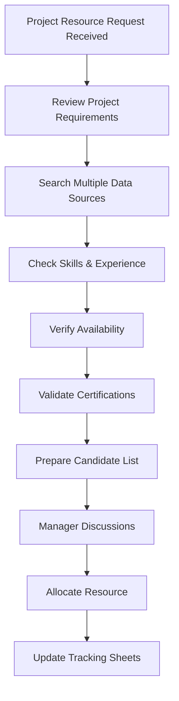
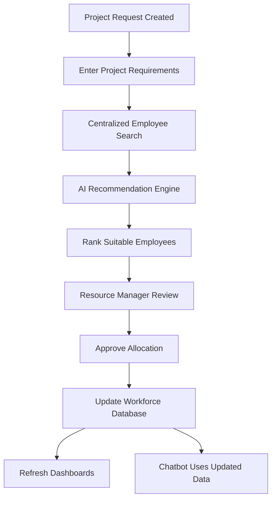

# WorkforceIQ

## Business Requirements & Product Requirements Document (BRD + PRD)

**Version:** 1.0

---

# 1. Document Control

## 1.1 Document Information

| Attribute | Details |
|-----------|---------|
| **Document Title** | Business Requirements & Product Requirements Document |
| **Project Name** | WorkforceIQ – AI Resource Allocation Assistant |
| **Document Version** | 1.0 |
| **Document Status** | Draft |
| **Prepared By** | Nitish Malik |
| **Prepared Date** | August 2026 |
| **Project Type** | Enterprise Workforce Resource Management System |
| **Development Methodology** | Agile Scrum |

---

## 1.2 Version History

| Version | Date | Author | Description |
|----------|------|--------|-------------|
| 1.0 | August 2026 | Nitish Malik | Initial release of the Business Requirements & Product Requirements Document |

---

## 1.3 Purpose of this Document

### Purpose

This document defines the business vision, product requirements, scope, stakeholders, functional requirements, non-functional requirements, and implementation roadmap for **WorkforceIQ**.

It serves as the primary reference throughout the software development lifecycle, ensuring that all stakeholders share a common understanding of the product before implementation begins.

The document also establishes the baseline against which future enhancements, change requests, and development sprints will be evaluated.

---

## 1.4 Intended Audience

This document is intended for the following stakeholders:

| Role | Responsibility |
|------|----------------|
| Product Owner | Defines business vision and priorities |
| Business Analyst | Documents requirements and business processes |
| Solution Architect | Designs the overall system architecture |
| Backend Developers | Develop APIs, business logic, and database components |
| Frontend Developers | Build the user interface and user experience |
| AI/ML Developers | Implement the recommendation engine |
| QA Engineers | Validate that the system meets defined requirements |
| Project Managers | Plan, monitor, and coordinate project execution |
| Recruiters & Interviewers | Review the project as part of the portfolio |

---

## 1.5 Document Objectives

The objectives of this document are to:

- Define the business problem addressed by WorkforceIQ.
- Describe the proposed software solution.
- Identify the stakeholders and end users.
- Establish the functional and non-functional requirements.
- Define the scope of the Minimum Viable Product (MVP).
- Provide a roadmap for Agile sprint-based implementation.
- Ensure traceability between business requirements and technical implementation.
- Act as a reference for future versions of the application.

---

# 2. Executive Summary

## 2.1 Introduction

Organizations today manage hundreds or even thousands of employees across multiple projects, technologies, clients, and business units. Ensuring that the right employee is assigned to the right project at the right time is one of the most critical responsibilities of Resource Management teams.

In many organizations, this process continues to rely heavily on manual decision-making, spreadsheets, emails, and fragmented information spread across multiple systems. As workforce size increases, these methods become increasingly inefficient, leading to delays in staffing, poor resource utilization, inconsistent allocation decisions, and reduced operational efficiency.

WorkforceIQ is proposed as an intelligent workforce management platform that simplifies and modernizes the resource allocation process. The application combines centralized employee and project management with AI-assisted recommendation capabilities, enabling Resource Managers to make faster, more informed allocation decisions based on employee skills, availability, experience, certifications, and project requirements.

Rather than replacing human decision-making, WorkforceIQ is designed to function as an intelligent decision-support system, providing recommendations while allowing managers to retain complete control over final resource allocation.

---

## 2.2 Business Need

Modern organizations face several challenges in workforce planning and resource allocation:

- Employee information is often distributed across multiple spreadsheets and business applications.
- Resource allocation decisions depend heavily on individual experience and manual analysis.
- Identifying employees with the required combination of technical skills, certifications, availability, and experience can be time-consuming.
- Bench management becomes increasingly difficult as workforce size grows.
- Management lacks real-time visibility into workforce utilization and allocation trends.
- Manual allocation increases the risk of assigning underqualified or unavailable resources to critical projects.

These challenges directly impact project delivery timelines, operational efficiency, employee utilization, and customer satisfaction.

A centralized, AI-assisted allocation platform can significantly reduce these inefficiencies while improving decision quality and transparency.

---

## 2.3 Proposed Solution

WorkforceIQ is an AI-powered Resource Allocation Assistant designed to support enterprise workforce planning through intelligent automation and centralized data management.

The application will provide capabilities to:

- Maintain employee profiles, including skills, experience, certifications, availability, and current assignments.
- Manage project requirements and staffing requests.
- Recommend the most suitable employees for projects using configurable recommendation logic.
- Search employees using multiple criteria, including skills, experience, location, and availability.
- Provide a conversational AI assistant capable of answering workforce-related queries.
- Present interactive dashboards that visualize workforce utilization, project allocation, skill distribution, and bench strength.
- Generate insights that support better workforce planning and business decision-making.

---

## 2.4 Expected Business Benefits

The successful implementation of WorkforceIQ is expected to provide measurable improvements in workforce management.

| Area | Expected Benefit |
|------|------------------|
| Resource Allocation | Faster identification of suitable employees for project assignments |
| Productivity | Reduced manual effort involved in resource planning |
| Utilization | Improved employee utilization and reduced bench time |
| Decision Quality | More consistent allocation decisions supported by data |
| Visibility | Real-time reporting of workforce availability and utilization |
| Project Delivery | Reduced staffing delays and improved project readiness |
| Analytics | Better workforce planning through centralized reporting and dashboards |

---

## 2.5 Success Vision

The long-term vision of WorkforceIQ is to evolve from a resource allocation application into an intelligent workforce management platform capable of supporting predictive workforce planning, AI-driven demand forecasting, skill gap analysis, certification recommendations, and strategic capacity planning.

Version 1.0 focuses on establishing a scalable foundation that can be incrementally enhanced through future Agile development cycles.

---

# 3. Business Problem Statement

## 3.1 Overview

Efficient workforce allocation is one of the most critical functions within project-driven organizations. Resource Managers are responsible for assigning the right employees to the right projects while considering multiple factors such as technical skills, experience, certifications, availability, project priorities, utilization, and business constraints.

As organizations scale, this process becomes increasingly complex. Manual resource planning methods that once worked for smaller teams become inefficient, difficult to maintain, and highly dependent on individual knowledge.

Without a centralized and intelligent resource management system, organizations struggle to make consistent, data-driven allocation decisions, resulting in operational inefficiencies and reduced workforce utilization.

---

## 3.2 Existing Business Challenges

The current resource allocation process presents several operational challenges.

### BP-001 – Manual Allocation Process

Resource Managers manually evaluate employee skills, availability, experience, and project requirements before assigning resources. This process consumes significant time and delays project staffing.

**Business Impact**

- Increased allocation time
- Higher dependency on manual effort
- Delayed project onboarding

---

### BP-002 – Fragmented Workforce Information

Employee information is often distributed across spreadsheets, HR systems, emails, and project tracking tools, making it difficult to obtain a complete view of workforce capabilities.

**Business Impact**

- Duplicate information
- Inconsistent employee records
- Poor visibility into workforce data

---

### BP-003 – Limited Skill Visibility

Finding employees with the appropriate combination of technical skills, certifications, domain expertise, and experience requires manual searching across multiple data sources.

**Business Impact**

- Slow staffing decisions
- Incorrect resource selection
- Underutilization of skilled employees

---

### BP-004 – Inefficient Bench Management

Organizations often lack real-time visibility into employees who are currently unallocated or approaching project completion.

**Business Impact**

- Increased bench costs
- Reduced workforce utilization
- Missed allocation opportunities

---

### BP-005 – Lack of Data-Driven Recommendations

Current allocation decisions depend primarily on individual experience instead of analytical recommendations based on workforce data.

**Business Impact**

- Inconsistent allocation decisions
- Reduced transparency
- Higher risk of unsuitable assignments

---

### BP-006 – Limited Workforce Analytics

Management lacks centralized reporting that provides insights into workforce utilization, project allocation, skill distribution, bench strength, and staffing trends.

**Business Impact**

- Poor strategic planning
- Limited operational visibility
- Reactive instead of proactive decision-making

---

## 3.3 Problem Statement

Organizations require an intelligent workforce management solution that centralizes employee and project information while assisting Resource Managers in making faster, more accurate, and data-driven allocation decisions.

The solution should reduce manual effort, improve workforce utilization, enhance resource visibility, and provide AI-assisted recommendations supported by analytics and conversational search capabilities.

---

## 3.4 Opportunity Statement

The implementation of WorkforceIQ provides an opportunity to modernize workforce management by introducing centralized resource data, intelligent allocation recommendations, real-time dashboards, and conversational AI.

Rather than replacing Resource Managers, WorkforceIQ enhances their decision-making process by providing actionable insights, reducing manual effort, and improving operational efficiency.

---

# 4. Business Objectives

## 4.1 Objective

The primary objective of WorkforceIQ is to improve the efficiency and accuracy of workforce resource allocation by providing an intelligent, centralized platform that assists Resource Managers in assigning the right employees to the right projects.

The solution aims to reduce manual effort, improve workforce utilization, provide greater visibility into employee capabilities, and support data-driven decision-making through AI-powered recommendations and analytics.

---

## 4.2 Business Goals

The project is designed to achieve the following business goals:

### BR-001 – Centralize Workforce Information

Create a single source of truth for employee, project, and skill data to eliminate fragmented information across spreadsheets and multiple systems.

---

### BR-002 – Improve Resource Allocation Efficiency

Reduce the time required to identify suitable employees for project assignments by providing centralized search capabilities and intelligent recommendations.

---

### BR-003 – Increase Workforce Utilization

Improve employee utilization by providing visibility into available resources, current allocations, and upcoming project availability.

---

### BR-004 – Support Data-Driven Decisions

Enable Resource Managers to make allocation decisions using structured workforce data instead of relying solely on manual judgment and individual experience.

---

### BR-005 – Improve Workforce Visibility

Provide real-time dashboards and reports that allow management to monitor utilization, allocation trends, bench strength, and workforce capacity.

---

### BR-006 – Enhance Decision Support with Artificial Intelligence

Provide AI-assisted recommendations that evaluate employee skills, experience, certifications, availability, and project requirements to recommend suitable candidates.

---

### BR-007 – Improve User Productivity

Reduce repetitive administrative tasks by enabling quick employee searches, automated recommendations, and conversational access to workforce information.

---

## 4.3 Business Success Criteria

The implementation of WorkforceIQ will be considered successful if it achieves the following outcomes:

- Resource allocation becomes faster and more efficient.
- Workforce information is maintained within a centralized platform.
- Resource Managers spend less time performing manual searches.
- Employee utilization improves through better allocation decisions.
- Management gains real-time visibility into workforce metrics.
- AI recommendations assist managers in identifying suitable resources.
- Workforce analytics support strategic planning and operational decision-making.

---

## 4.4 Alignment with Business Strategy

WorkforceIQ supports modern workforce management practices by combining centralized data management, artificial intelligence, analytics, and automation into a single platform.

The solution aligns with organizational goals of improving operational efficiency, maximizing workforce utilization, reducing manual effort, and enabling scalable resource planning as the organization grows.

---

# 5. Project Scope

## 5.1 Project Scope Overview

The scope of WorkforceIQ Version 1.0 focuses on delivering a Minimum Viable Product (MVP) that addresses the core challenges of workforce resource allocation. The application will provide centralized employee and project management, AI-assisted resource recommendations, workforce analytics, and conversational search capabilities.

The MVP is designed to establish a scalable foundation that can be extended with additional enterprise features in future releases.

---

## 5.2 In Scope (Version 1.0)

The following capabilities are included in the first release of WorkforceIQ.

### Employee Management

- Create employee profiles
- Update employee information
- Delete employee records
- View employee details
- Manage employee skills
- Track employee availability
- Track employee experience
- Store certifications

---

### Project Management

- Create projects
- Update project details
- Manage project requirements
- Track project status
- Define required skills
- View assigned resources

---

### Resource Allocation

- AI-assisted employee recommendations
- Manual resource allocation
- View current allocations
- View employee utilization
- Resource search by multiple criteria

---

### AI Features

- Intelligent recommendation engine
- Skill matching
- Experience matching
- Availability matching
- Recommendation scoring

---

### Chatbot

- Natural language workforce queries
- Employee search
- Project search
- Skill lookup
- Resource availability lookup

---

### Dashboard & Analytics

- Workforce utilization dashboard
- Bench dashboard
- Skill distribution dashboard
- Project allocation dashboard
- Summary KPIs

---

### Technical Deliverables

- FastAPI backend
- REST APIs
- SQLAlchemy ORM
- SQLite database (development)
- PostgreSQL-ready architecture
- React frontend
- GitHub repository
- Technical documentation

---

## 5.3 Out of Scope (Version 1.0)

The following features are intentionally excluded from the initial release.

### Human Resource Management

- Payroll processing
- Leave management
- Attendance tracking
- Performance appraisal
- Recruitment management
- Employee onboarding

---

### Financial Management

- Billing
- Invoicing
- Budget planning
- Cost forecasting
- Revenue reporting

---

### Advanced AI

- Demand forecasting
- Workforce capacity prediction
- Auto-allocation without approval
- Learning recommendations
- Career path recommendations

---

### Enterprise Integrations

- SAP integration
- Workday integration
- Microsoft Teams integration
- Outlook integration
- Jira integration
- ServiceNow integration

---

## 5.4 Assumptions

The following assumptions apply to Version 1.0:

- Employee data is maintained accurately.
- Project requirements are entered correctly.
- Skills follow a standardized naming convention.
- Users have appropriate system access.
- AI recommendations support, but do not replace, human decision-making.

---

## 5.5 Constraints

The initial release will operate under the following constraints:

- SQLite will be used during development.
- Authentication will be basic in Version 1.0.
- AI recommendations will use rule-based logic before introducing machine learning.
- The application is designed as a portfolio project rather than a production deployment.
- External enterprise integrations are excluded from the MVP.

---

## 5.6 Deliverables

The expected deliverables for Version 1.0 include:

- WorkforceIQ Web Application
- REST API Backend
- AI Recommendation Engine
- Workforce Chatbot
- Analytics Dashboard
- Source Code Repository
- Business Requirements & Product Requirements Document
- System Design Document
- User Guide

---

# 6. Stakeholder Analysis

## 6.1 Overview

Stakeholders are individuals or groups who influence, use, support, or are impacted by WorkforceIQ. Understanding stakeholder responsibilities and expectations ensures that the solution addresses both business and technical requirements while supporting successful adoption across the organization.

---

## 6.2 Stakeholder Identification

| Stakeholder | Role | Interest in WorkforceIQ |
|--------------|------|-------------------------|
| Resource Manager | Primary User | Allocate employees to projects efficiently and maximize workforce utilization. |
| Delivery Manager | Business User | Request suitable resources for projects and monitor staffing progress. |
| HR Team | Data Owner | Maintain accurate employee profiles, skills, certifications, and employment information. |
| Practice Manager | Business Owner | Monitor workforce capacity, skill availability, and strategic resource planning. |
| Project Manager | Operational User | Track assigned team members and identify staffing gaps. |
| Employees | End User | Maintain personal skill profiles and view current project assignments. |
| Executive Management | Decision Maker | Monitor organizational utilization, project readiness, and workforce performance through dashboards. |
| System Administrator | Technical User | Configure, maintain, secure, and monitor the application. |

---

## 6.3 Stakeholder Responsibilities

### Resource Manager

**Responsibilities**

- Search available employees
- Review AI recommendations
- Allocate resources to projects
- Monitor workforce utilization
- Manage bench resources

**Primary Success Criteria**

- Reduced allocation effort
- Faster staffing decisions
- Improved resource utilization

---

### Delivery Manager

**Responsibilities**

- Create project resource requests
- Review staffing recommendations
- Monitor project staffing
- Coordinate with Resource Managers

**Primary Success Criteria**

- Faster project onboarding
- Improved staffing accuracy

---

### HR Team

**Responsibilities**

- Maintain employee master data
- Update certifications
- Maintain skill inventories
- Ensure workforce data accuracy

**Primary Success Criteria**

- Accurate employee information
- Reliable workforce database

---

### Practice Manager

**Responsibilities**

- Monitor workforce demand
- Identify skill shortages
- Plan hiring requirements
- Review utilization reports

**Primary Success Criteria**

- Strategic workforce planning
- Improved capacity management

---

### Executive Management

**Responsibilities**

- Monitor business KPIs
- Review utilization trends
- Evaluate workforce efficiency
- Support strategic decisions

**Primary Success Criteria**

- Real-time business insights
- Better operational visibility

---

### System Administrator

**Responsibilities**

- User management
- Role management
- System monitoring
- Security management
- Backup and recovery

**Primary Success Criteria**

- Stable system availability
- Secure platform operation

---

## 6.4 Stakeholder Expectations

The stakeholders expect WorkforceIQ to:

- Reduce manual allocation effort.
- Improve resource visibility.
- Increase workforce utilization.
- Deliver accurate AI-assisted recommendations.
- Provide centralized workforce information.
- Offer intuitive dashboards and reporting.
- Improve project staffing efficiency.
- Support future organizational growth.

---

## 6.5 Stakeholder Influence Matrix

| Stakeholder | Influence | Interest | Engagement Strategy |
|--------------|-----------|----------|---------------------|
| Executive Management | High | High | Keep closely informed through dashboards and reports |
| Resource Manager | High | High | Continuous involvement throughout development |
| Delivery Manager | High | High | Gather feedback during sprint reviews |
| HR Team | Medium | High | Validate employee data processes |
| Practice Manager | High | Medium | Review workforce planning capabilities |
| Employees | Low | Medium | Collect usability feedback |
| System Administrator | Medium | High | Review technical implementation and security |

---

# 7. User Roles & Personas

## 7.1 User Roles

WorkforceIQ supports multiple user roles, each with distinct responsibilities and system permissions. Defining these roles ensures that users access only the features and data relevant to their responsibilities.

| Role | Description |
|------|-------------|
| Resource Manager | Manages workforce allocation, employee availability, and utilization. |
| Delivery Manager | Creates project staffing requests and monitors project allocations. |
| HR Executive | Maintains employee master data, certifications, and skills. |
| Practice Manager | Reviews workforce capacity, utilization, and strategic planning metrics. |
| Executive | Views dashboards and organizational KPIs for decision-making. |
| Employee | Maintains personal profile and views assigned projects. |
| System Administrator | Manages users, roles, permissions, and system configuration. |

---

## 7.2 User Personas

### Persona 1 – Resource Manager

| Attribute | Details |
|-----------|---------|
| Name | Priya Sharma |
| Role | Resource Manager |
| Experience | 8 Years |
| Primary Device | Laptop |
| System Usage | Daily |

**Responsibilities**

- Allocate employees to projects
- Review AI recommendations
- Track employee utilization
- Monitor bench resources

**Goals**

- Reduce allocation time
- Improve utilization
- Find suitable employees quickly
- Minimize manual effort

**Pain Points**

- Searching multiple spreadsheets
- Lack of centralized employee data
- Delayed staffing decisions
- Manual allocation process

---

### Persona 2 – Delivery Manager

| Attribute | Details |
|-----------|---------|
| Name | Rahul Mehta |
| Role | Delivery Manager |
| Experience | 10 Years |
| System Usage | Daily |

**Responsibilities**

- Raise staffing requests
- Monitor project staffing
- Coordinate with Resource Managers

**Goals**

- Staff projects quickly
- Reduce project delays
- Track staffing progress

**Pain Points**

- Limited visibility into available resources
- Delayed staffing approvals
- Difficulty identifying required skills

---

### Persona 3 – HR Executive

| Attribute | Details |
|-----------|---------|
| Name | Sneha Kapoor |
| Role | HR Executive |
| Experience | 6 Years |
| System Usage | Weekly |

**Responsibilities**

- Maintain employee records
- Update skills and certifications
- Manage employee information

**Goals**

- Keep workforce data accurate
- Simplify profile maintenance

**Pain Points**

- Duplicate employee records
- Outdated skill information
- Manual updates

---

### Persona 4 – Executive Leadership

| Attribute | Details |
|-----------|---------|
| Name | Amit Verma |
| Role | Director – Delivery Operations |
| Experience | 18 Years |
| System Usage | Weekly |

**Responsibilities**

- Review workforce KPIs
- Monitor utilization
- Track delivery readiness
- Support strategic planning

**Goals**

- Improve operational efficiency
- Increase workforce utilization
- Reduce bench costs

**Pain Points**

- Limited business visibility
- Delayed reporting
- Lack of predictive insights

---

## 7.3 User Goals

Across all user roles, WorkforceIQ aims to help users:

- Complete resource allocation faster.
- Improve workforce utilization.
- Access centralized workforce information.
- Make informed allocation decisions.
- Reduce manual administrative effort.
- Improve collaboration between business functions.

---

## 7.4 User Pain Points

The primary user pain points addressed by WorkforceIQ include:

- Time-consuming manual allocation.
- Scattered employee information.
- Limited visibility into workforce availability.
- Difficulty identifying employees with specific skills.
- Lack of intelligent recommendations.
- Limited reporting and analytics.

---

## 7.5 User Success Criteria

The solution will be considered successful from a user perspective if:

- Users can locate suitable employees within minutes.
- Resource allocation effort is significantly reduced.
- Workforce information remains accurate and centralized.
- Dashboards provide actionable insights.
- AI recommendations improve staffing decisions.
- Users can complete common tasks with minimal manual effort.

---

# 8. Current Business Process (As-Is)

## 8.1 Overview

The current workforce allocation process relies heavily on manual coordination between Resource Managers, Delivery Managers, HR teams, and Project Managers. Employee information is maintained across multiple spreadsheets, emails, HR systems, and project trackers, requiring Resource Managers to manually gather, validate, and compare information before making allocation decisions.

As the workforce grows, this process becomes increasingly time-consuming, inconsistent, and prone to human error. Decision-making depends largely on individual experience rather than centralized data and analytical insights.

---

## 8.2 Current Resource Allocation Process

The current process typically follows these steps:

1. A Delivery Manager submits a request for project resources.
2. The Resource Manager reviews the project requirements.
3. Employee information is collected from multiple sources such as spreadsheets, HR systems, emails, or internal trackers.
4. The Resource Manager manually searches for employees with the required skills and experience.
5. Employee availability is verified separately.
6. Certifications and domain knowledge are validated manually.
7. Potential candidates are shortlisted.
8. Discussions take place between Delivery Managers, Resource Managers, and HR.
9. Final allocation decisions are made.
10. Allocation records are manually updated.

---

## 8.3 Current Process Flow

---

## 8.4 Process Pain Points

| Process Step | Existing Challenge | Business Problem ID |
|--------------|-------------------|---------------------|
| Resource Request Review | Manual coordination | BP-001 |
| Employee Search | Multiple spreadsheets | BP-002 |
| Skill Verification | Difficult to locate required skills | BP-003 |
| Availability Check | Separate verification process | BP-004 |
| Candidate Evaluation | Manual comparison of employees | BP-005 |
| Reporting | Limited workforce visibility | BP-006 |

---

## 8.5 Process Limitations

The existing process presents several operational limitations:

- Heavy dependence on manual effort.
- Resource information stored across disconnected systems.
- Lack of centralized workforce visibility.
- Slow resource identification.
- Inconsistent allocation decisions.
- Limited reporting capabilities.
- Difficulty monitoring workforce utilization.
- Limited support for strategic workforce planning.

---

## 8.6 Risks in the Current Process

The current manual approach introduces several business risks:

| Risk | Impact |
|------|--------|
| Incorrect resource allocation | Reduced project quality |
| Delayed staffing | Project delivery delays |
| Underutilized workforce | Increased operational cost |
| Skill mismatch | Reduced customer satisfaction |
| Data inconsistency | Incorrect business decisions |
| Manual reporting | Delayed management insights |

---

## 8.7 Summary

The current workforce allocation process is operationally functional but heavily dependent on manual effort, fragmented information, and individual experience. As workforce size and project complexity increase, these limitations become more significant, creating a strong need for a centralized, intelligent, and scalable workforce management platform.

---

# 9. Proposed Business Process (To-Be)

## 9.1 Overview

WorkforceIQ introduces a centralized and AI-assisted resource allocation process that replaces manual searching, fragmented workforce information, and spreadsheet-based decision-making with a unified workforce intelligence platform.

The proposed process enables Resource Managers to identify suitable employees faster by combining employee profiles, project requirements, workforce availability, AI recommendations, and analytical dashboards into a single application.

The objective is not to replace human decision-making but to enhance it by providing accurate, data-driven recommendations that improve allocation quality and reduce manual effort.

---

## 9.2 Future Resource Allocation Process

The proposed process consists of the following steps:

1. Delivery Manager creates a new project request.
2. Project requirements are entered into WorkforceIQ.
3. WorkforceIQ searches the centralized employee database.
4. AI Recommendation Engine evaluates suitable employees based on:
   - Required Skills
   - Experience
   - Certifications
   - Availability
   - Current Utilization
5. AI generates a ranked recommendation list.
6. Resource Manager reviews recommendations.
7. Resource Manager approves or modifies the recommendation.
8. Employee is allocated to the project.
9. Dashboards update automatically.
10. Chatbot immediately reflects the latest workforce information.

---

## 9.3 Future Process Flow

---

## 9.4 Business Improvements

| Current Challenge | WorkforceIQ Improvement | Business Requirement |
|-------------------|-------------------------|----------------------|
| Manual allocation | AI-assisted recommendations | BR-006 |
| Multiple spreadsheets | Centralized workforce database | BR-001 |
| Slow employee search | Intelligent skill search | BR-002 |
| Low utilization visibility | Workforce dashboards | BR-005 |
| Manual decision making | Recommendation scoring | BR-004 |
| Limited workforce analytics | Interactive dashboards | BR-005 |
| High administrative effort | Automated workflows | BR-007 |

---

## 9.5 Expected Benefits

The proposed solution is expected to deliver the following operational improvements:

- Reduced allocation time.
- Improved workforce utilization.
- Increased visibility into workforce availability.
- Better allocation consistency.
- Centralized workforce information.
- Faster staffing decisions.
- Reduced manual administrative effort.
- Improved strategic workforce planning.

---

## 9.6 Process Comparison

| Activity | Current Process | WorkforceIQ Process |
|----------|----------------|---------------------|
| Employee Search | Manual | AI-assisted |
| Skill Verification | Spreadsheet Review | Centralized Database |
| Availability Check | Manual | Real-Time |
| Recommendation | Human Experience | AI Recommendation |
| Reporting | Manual Reports | Live Dashboards |
| Data Source | Multiple Systems | Single Platform |
| Decision Support | Limited | Data-Driven |
| Analytics | Limited | Interactive |

---

## 9.7 Future State Vision

The implementation of WorkforceIQ transforms workforce management from a reactive and manual process into a centralized, intelligent, and data-driven operation.

By integrating employee management, project management, artificial intelligence, dashboards, and conversational search into one platform, WorkforceIQ enables organizations to improve operational efficiency, optimize workforce utilization, and support informed business decisions while maintaining full managerial control over resource allocation.

---

# 10. Functional Requirements

## 10.1 Overview

Functional requirements describe the business capabilities that WorkforceIQ must provide to its users. Each requirement is uniquely identified and categorized by module to ensure traceability throughout the software development lifecycle.

Every functional requirement defined in this document will be mapped to future APIs, database entities, user interface components, sprint tasks, and test cases.

---

# Module A – Employee Management

## FR-EMP-001 – Create Employee

**Description**

The system shall allow authorized users to create a new employee profile.

**Priority**

Must Have

**Actors**

- HR Executive
- System Administrator

**Acceptance Criteria**

- Employee ID must be unique.
- Mandatory fields must be validated.
- Employee profile must be stored successfully.
- Success confirmation shall be displayed.

---

## FR-EMP-002 – Update Employee

**Description**

The system shall allow authorized users to update employee information including skills, certifications, experience, availability, and contact information.

**Priority**

Must Have

**Actors**

- HR Executive
- System Administrator

**Acceptance Criteria**

- Existing records shall be editable.
- All modifications shall be saved.
- Validation errors shall be displayed where applicable.

---

## FR-EMP-003 – Delete Employee

**Description**

The system shall allow authorized users to deactivate or remove employee records.

**Priority**

Should Have

**Actors**

- System Administrator

**Acceptance Criteria**

- Confirmation must be requested before deletion.
- Historical allocation records shall remain preserved.
- Employee status shall update appropriately.

---

## FR-EMP-004 – Search Employee

**Description**

The system shall allow users to search employees using multiple criteria.

Supported search parameters include:

- Name
- Skill
- Experience
- Certification
- Availability
- Location
- Department

**Priority**

Must Have

---

## FR-EMP-005 – View Employee Profile

**Description**

The system shall display a complete employee profile containing:

- Personal Information
- Skills
- Experience
- Certifications
- Availability
- Current Project
- Utilization
- Allocation History

**Priority**

Must Have

---

# Module B – Skills Management

## FR-SKL-001 – Manage Skills

The system shall allow HR users to create, update, and deactivate skills.

---

## FR-SKL-002 – Assign Skills

The system shall allow multiple skills to be assigned to each employee.

---

## FR-SKL-003 – Skill Proficiency

Each employee skill shall include a proficiency level.

Supported values:

- Beginner
- Intermediate
- Advanced
- Expert

---

## FR-SKL-004 – Certification Management

The system shall maintain employee certifications including:

- Certification Name
- Issuing Organization
- Issue Date
- Expiry Date

---

## FR-SKL-005 – Skill Search

Users shall be able to search employees using one or more required skills.

---

---

# 11. Non-Functional Requirements

## 11.1 Overview

Non-functional requirements define the quality attributes of WorkforceIQ. These requirements ensure that the application is secure, reliable, scalable, performant, and easy to use.

| ID | Requirement | Priority |
|----|-------------|----------|
| NFR-001 | System response time for standard operations should be less than 3 seconds. | High |
| NFR-002 | Dashboard pages should load within 5 seconds. | High |
| NFR-003 | System shall support role-based access control. | High |
| NFR-004 | Sensitive information shall be protected using secure authentication and authorization mechanisms. | High |
| NFR-005 | The application shall maintain data integrity across all modules. | High |
| NFR-006 | The application architecture shall support migration from SQLite to PostgreSQL without major redesign. | Medium |
| NFR-007 | REST APIs shall follow consistent naming conventions and HTTP standards. | High |
| NFR-008 | The system shall maintain audit logs for critical business operations. | Medium |
| NFR-009 | The user interface shall remain responsive across modern desktop browsers. | Medium |
| NFR-010 | Source code shall follow established coding standards and documentation guidelines. | High |

---

# 12. Business Success Metrics (KPIs)

The success of WorkforceIQ will be measured using the following business indicators.

| KPI | Target |
|------|--------|
| Average Resource Allocation Time | Reduce by 60% |
| Workforce Utilization | > 85% |
| Manual Allocation Effort | Reduce by 50% |
| Recommendation Acceptance Rate | > 80% |
| Dashboard Availability | > 99% |
| Employee Search Time | < 30 seconds |
| Data Accuracy | > 98% |
| User Satisfaction | > 4.5 / 5 |

---

# 13. Risks, Assumptions & Constraints

## Risks

| Risk | Impact | Mitigation |
|------|--------|------------|
| Incomplete employee data | High | Mandatory profile validation |
| Incorrect project requirements | Medium | Validation before allocation |
| AI recommendation bias | Medium | Human approval required |
| Poor user adoption | Medium | Simple UI and user training |
| Future scalability | Medium | Modular architecture |

## Assumptions

- Employee data is maintained accurately.
- Project requirements are entered correctly.
- Users possess appropriate permissions.
- AI recommendations support, but do not replace, business decisions.

## Constraints

- SQLite will be used during development.
- Initial AI recommendations will be rule-based.
- External enterprise integrations are outside the scope of Version 1.0.

---

# 14. Future Enhancements

Potential future capabilities include:

- Predictive workforce planning
- Machine learning recommendation engine
- Certification expiry notifications
- Workforce demand forecasting
- Multi-language chatbot
- Microsoft Teams integration
- Outlook integration
- SAP integration
- Workday integration
- Mobile application
- Advanced analytics
- Skill gap analysis
- Capacity planning
- Automated allocation suggestions

---

# 15. Release Roadmap

| Release | Objective |
|----------|-----------|
| Version 1.0 | MVP with employee, project, AI recommendation, chatbot and dashboard modules |
| Version 1.1 | Authentication improvements, notifications and reporting enhancements |
| Version 2.0 | Predictive analytics, machine learning recommendations and enterprise integrations |
| Version 3.0 | Workforce forecasting, optimization algorithms and advanced planning capabilities |

---

# 16. Business Value Assessment

The implementation of WorkforceIQ is expected to deliver measurable business value by improving workforce visibility, reducing manual effort, increasing employee utilization, and enabling data-driven resource allocation.

Key business outcomes include:

- Improved staffing efficiency
- Reduced operational overhead
- Better workforce utilization
- Improved decision quality
- Enhanced management visibility
- Centralized workforce information
- AI-assisted resource planning
- Improved organizational scalability

---

# 17. Project Governance

## Development Methodology

- Agile Scrum

## Version Control

- Git
- GitHub

## Documentation

- Business Requirements & Product Requirements Document
- Software Requirements Specification
- System Design Document
- API Documentation
- User Guide

## Change Management

All future changes shall be reviewed, documented, versioned, and approved before implementation.

---

# 18. Conclusion

WorkforceIQ is designed as an intelligent workforce management platform that modernizes the traditional resource allocation process through centralized workforce information, AI-assisted recommendations, analytics, and conversational search.

The application focuses on improving workforce utilization, reducing manual effort, increasing operational visibility, and supporting better business decisions while maintaining human oversight over allocation activities.

This Business Requirements & Product Requirements Document establishes the foundation for subsequent phases of the project, including detailed software requirements, technical architecture, implementation, testing, and deployment.

---

# 19. Appendix

## Acronyms

| Acronym | Meaning |
|----------|---------|
| AI | Artificial Intelligence |
| API | Application Programming Interface |
| BRD | Business Requirements Document |
| PRD | Product Requirements Document |
| SRS | Software Requirements Specification |
| SDD | System Design Document |
| KPI | Key Performance Indicator |
| RBAC | Role-Based Access Control |
| REST | Representational State Transfer |
| ORM | Object Relational Mapping |

---

## Document Status

**Document Version:** 1.0

**Status:** Approved

**Prepared By:** Nitish Malik

**Document Classification:** Internal Project Documentation