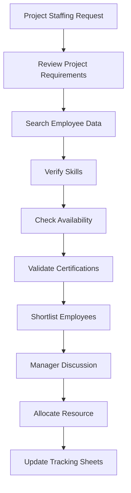
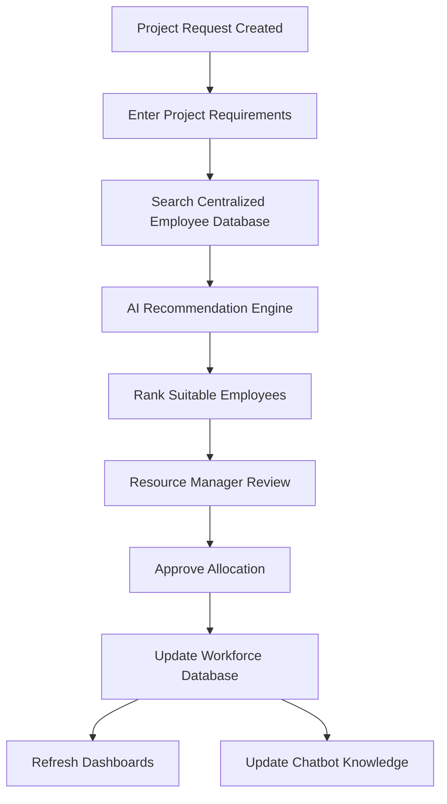

# WorkforceIQ

# Business Requirements Document (BRD) & Product Requirements Document (PRD)

---

## Document Information

| Item | Details |
|------|---------|
| Product Name | WorkforceIQ |
| Document Type | Business Requirements Document (BRD) & Product Requirements Document (PRD) |
| Version | 1.0 |
| Status | Approved |
| Project Type | AI-Powered Workforce Management Platform |
| Methodology | Agile Scrum |
| Prepared By | Nitish Malik |
| Language | English |
| Repository | AI-Workforce-Intelligence-Platform |

---

## Document Purpose

This document defines the business vision, product objectives, business requirements, functional scope, and high-level solution approach for WorkforceIQ.

It serves as the primary reference for business stakeholders, product planning, solution design, and future software development activities.

The document establishes the business baseline for Version 1.0 of WorkforceIQ and provides traceability between business problems, business objectives, product capabilities, and future technical implementation.

---

## Intended Audience

This document is intended for:

- Product Owner
- Business Analyst
- Solution Architect
- Software Developers
- QA Engineers
- Project Managers
- Future Contributors

---

## Version History

| Version | Date | Author | Description |
|----------|------|--------|-------------|
| 1.0 | August 2026 | Nitish Malik | Initial Approved Release |

---

## Approval Status

| Role | Owner | Status |
|------|-------|--------|
| Product Owner | Nitish Malik | Approved  |
| Business Analyst | Nitish Malik | Approved  |
| Solution Architect | Nitish Malik | Approved  |

---

# 1. Introduction

## 1.1 Purpose

The purpose of this Business Requirements Document (BRD) & Product Requirements Document (PRD) is to define the business vision, objectives, scope, stakeholders, functional capabilities, and high-level product requirements for WorkforceIQ Version 1.0.

This document serves as the official business baseline for the project and provides the foundation for all subsequent technical documentation, including the Software Requirements Specification (SRS), System Design Document (SDD), Database Design, API Specification, testing strategy, and software implementation.

---

## 1.2 Project Overview

WorkforceIQ is an AI-powered workforce management platform designed to improve workforce planning and resource allocation within project-driven organizations.

The platform centralizes employee, project, and skill information while providing AI-assisted recommendations, workforce analytics, and conversational search capabilities to support faster, more accurate, and data-driven staffing decisions.

---

## 1.3 Document Scope

This document defines:

- Business problem statement
- Business objectives
- Product vision
- Project scope
- Stakeholder analysis
- User personas
- Current and future business processes
- High-level functional requirements
- Non-functional requirements
- Business success metrics
- Risks, assumptions, and constraints
- Product roadmap
- Governance framework

Detailed software behavior, business rules, API specifications, database design, and technical implementation are intentionally excluded and will be documented in the Software Requirements Specification (SRS).

---

## 1.4 Intended Audience

This document is intended for:

- Product Owners
- Business Analysts
- Solution Architects
- Software Developers
- Quality Assurance Engineers
- Project Managers
- Future Contributors

---

## 1.5 Document Structure

The document is organized into five major areas:

1. Business Context
2. Business Analysis
3. Product Definition
4. Project Governance
5. Project Closure & Reference Information

Each section builds upon the previous one to provide complete traceability from business objectives to future software implementation.

---

# 2. Executive Summary

## 2.1 Introduction

WorkforceIQ is an AI-powered workforce management platform designed to improve the efficiency, accuracy, and transparency of workforce resource allocation within project-driven organizations.

The platform provides Resource Managers, Delivery Managers, HR teams, and executive leadership with a centralized solution for managing employee profiles, project requirements, workforce utilization, and intelligent resource recommendations.

Rather than replacing human decision-making, WorkforceIQ augments it by providing AI-assisted recommendations, workforce analytics, and conversational search capabilities that enable faster and more informed staffing decisions.

---

## 2.2 Business Need

Organizations that manage large workforces often rely on spreadsheets, emails, HR systems, and individual experience to allocate employees to projects. As workforce size increases, these manual processes become inefficient, inconsistent, and difficult to scale.

Key challenges include:

- Fragmented employee information
- Manual skill matching
- Limited workforce visibility
- Inefficient bench management
- Slow staffing decisions
- Lack of analytical insights
- High dependency on individual knowledge

These challenges negatively impact workforce utilization, project delivery timelines, and operational efficiency.

---

## 2.3 Proposed Solution

WorkforceIQ provides a centralized workforce intelligence platform that enables organizations to:

- Maintain centralized employee profiles
- Manage project requirements
- Track workforce availability
- Monitor employee utilization
- Generate AI-assisted resource recommendations
- Provide workforce analytics dashboards
- Support natural language workforce queries through an integrated chatbot

The solution combines modern web technologies, business intelligence, and artificial intelligence into a unified platform that simplifies workforce planning and resource allocation.

---

## 2.4 Business Objectives

The primary objectives of WorkforceIQ are to:

- Improve workforce allocation efficiency
- Reduce manual administrative effort
- Increase employee utilization
- Provide centralized workforce information
- Support data-driven allocation decisions
- Improve project staffing visibility
- Enhance workforce analytics and reporting

---

## 2.5 Expected Business Benefits

The implementation of WorkforceIQ is expected to deliver measurable business value by:

- Reducing resource allocation time
- Improving workforce utilization
- Increasing visibility into employee availability
- Improving staffing accuracy
- Reducing dependence on spreadsheets
- Supporting strategic workforce planning
- Enabling scalable workforce management

---

## 2.6 Product Vision

To become an intelligent workforce management platform that empowers organizations to make faster, smarter, and more transparent workforce allocation decisions through centralized data, analytics, and AI-assisted recommendations.

---

# 3. Business Problem Statement

## 3.1 Overview

Efficient workforce allocation is one of the most critical operational activities within project-based organizations. Resource Managers are responsible for assigning employees to projects while balancing business priorities, employee availability, technical skills, experience, certifications, utilization, and customer requirements.

As organizations expand, manual workforce planning becomes increasingly complex. Existing allocation processes often rely on spreadsheets, emails, HR applications, and personal experience, resulting in inconsistent decisions and operational inefficiencies.

WorkforceIQ addresses these challenges by introducing a centralized, intelligent workforce management platform that improves visibility, supports decision-making, and enhances workforce utilization.

---

## 3.2 Existing Business Challenges

### BP-001 – Manual Resource Allocation

Resource Managers manually review employee information before making allocation decisions.

**Business Impact**

- Increased allocation time
- Delayed project staffing
- High administrative effort

---

### BP-002 – Fragmented Workforce Information

Employee information is distributed across multiple systems, reducing visibility and increasing data inconsistency.

**Business Impact**

- Duplicate information
- Limited workforce visibility
- Increased maintenance effort

---

### BP-003 – Limited Skill Visibility

Identifying employees with appropriate skills and experience requires manual searching across multiple sources.

**Business Impact**

- Incorrect staffing decisions
- Slow resource identification
- Underutilized workforce

---

### BP-004 – Poor Bench Visibility

Organizations often lack real-time insight into employees who are available for new assignments.

**Business Impact**

- Increased bench costs
- Reduced workforce utilization
- Missed staffing opportunities

---

### BP-005 – Experience-Based Decision Making

Allocation decisions rely heavily on individual knowledge instead of structured business data.

**Business Impact**

- Inconsistent allocation quality
- Reduced transparency
- Limited scalability

---

### BP-006 – Limited Workforce Analytics

Management lacks centralized reporting for utilization, staffing, capacity, and workforce trends.

**Business Impact**

- Poor strategic planning
- Limited operational insight
- Reactive decision making

---

## 3.3 Problem Statement

Organizations require a centralized workforce intelligence platform that consolidates employee and project information while assisting Resource Managers with faster, more accurate, and data-driven allocation decisions.

The solution should reduce manual effort, improve workforce visibility, enhance utilization, and support strategic planning through AI-assisted recommendations and workforce analytics.

---

## 3.4 Opportunity Statement

WorkforceIQ provides an opportunity to modernize workforce management by introducing centralized employee information, intelligent recommendation capabilities, workforce analytics, and conversational search into a single integrated platform.

The solution enhances—not replaces—human decision-making by providing actionable recommendations supported by structured workforce data.

---

# 4. Business Objectives

## 4.1 Objective

The primary objective of WorkforceIQ is to improve workforce allocation efficiency by providing an intelligent, centralized platform that supports faster and more accurate staffing decisions.

---

## 4.2 Business Goals

### BR-001 – Centralize Workforce Information

Provide a single source of truth for employee, project, and skill information.

---

### BR-002 – Improve Allocation Efficiency

Reduce the effort required to identify suitable employees for project assignments.

---

### BR-003 – Increase Workforce Utilization

Improve employee utilization through better allocation visibility and planning.

---

### BR-004 – Enable Data-Driven Decisions

Support allocation decisions using workforce data and AI-assisted recommendations.

---

### BR-005 – Improve Workforce Visibility

Provide dashboards and reports for utilization, staffing, and workforce analytics.

---

### BR-006 – Introduce AI-Assisted Recommendations

Recommend suitable employees using skills, experience, certifications, utilization, and availability.

---

### BR-007 – Improve User Productivity

Reduce repetitive administrative activities through automation, intelligent search, and conversational access to workforce information.

---

## 4.3 Success Criteria

The project will be considered successful when:

- Resource allocation becomes faster.
- Workforce utilization improves.
- Employee information is centralized.
- AI recommendations support staffing decisions.
- Workforce dashboards provide meaningful insights.
- Manual effort is significantly reduced.

---

## 4.4 Strategic Alignment

WorkforceIQ aligns with modern digital transformation initiatives by combining workforce management, business intelligence, artificial intelligence, and analytics into a unified platform that improves operational efficiency and organizational scalability.

---

# 5. Project Scope

## 5.1 Scope Overview

The scope of WorkforceIQ Version 1.0 is focused on delivering a Minimum Viable Product (MVP) that addresses the core challenges of workforce resource allocation. The application will centralize workforce information, simplify project staffing, provide AI-assisted recommendations, and offer workforce analytics to improve operational efficiency.

The solution is designed with scalability in mind, allowing future enhancements without requiring significant architectural redesign.

---

## 5.2 In Scope (Version 1.0)

The following capabilities are included in the initial release.

### Employee Management

- Create employee profiles
- Update employee information
- View employee profiles
- Deactivate employee records
- Manage employee skills
- Manage certifications
- Track employee availability
- Track employee utilization
- View allocation history

---

### Project Management

- Create projects
- Update project information
- Manage project requirements
- Define required skills
- Track project status
- View assigned resources

---

### Resource Allocation

- Search employees
- View workforce availability
- Allocate employees to projects
- Modify allocations
- Release employees from projects
- Track allocation history

---

### Skills Management

- Create skills
- Update skills
- Assign skills to employees
- Maintain proficiency levels
- Manage certifications

---

### AI Recommendation Engine

- Skill matching
- Experience matching
- Certification matching
- Availability analysis
- Utilization analysis
- Recommendation ranking

---

### Dashboard & Analytics

- Workforce utilization dashboard
- Bench dashboard
- Project allocation dashboard
- Skill distribution dashboard
- Executive KPI dashboard

---

### Conversational Assistant

The chatbot shall support natural language queries for:

- Employee search
- Skill lookup
- Resource availability
- Project allocation
- Workforce statistics

---

### Technical Deliverables

- React Web Application
- FastAPI Backend
- REST APIs
- SQLAlchemy ORM
- SQLite Development Database
- PostgreSQL-ready Architecture
- GitHub Repository
- Swagger API Documentation

---

## 5.3 Out of Scope (Version 1.0)

The following capabilities are intentionally excluded.

### Human Resource Functions

- Payroll
- Leave Management
- Attendance
- Recruitment
- Performance Appraisal
- Employee Onboarding

---

### Financial Functions

- Budget Planning
- Billing
- Revenue Tracking
- Cost Forecasting

---

### Enterprise Integrations

- SAP
- Workday
- Microsoft Teams
- Outlook
- Jira
- ServiceNow

---

### Advanced AI

- Machine Learning Models
- Workforce Forecasting
- Capacity Prediction
- Auto Allocation
- Career Recommendations

---

## 5.4 Assumptions

The project assumes that:

- Employee information is accurate.
- Project requirements are maintained correctly.
- Skills follow standardized naming conventions.
- Business users provide accurate allocation information.
- AI recommendations support—not replace—human decision making.

---

## 5.5 Constraints

The project is subject to the following constraints.

- SQLite will be used during development.
- Authentication will initially support basic role-based access.
- AI recommendations will initially use business rules rather than machine learning.
- External enterprise integrations are excluded from Version 1.0.

---

## 5.6 Key Deliverables

The project will deliver:

- WorkforceIQ Web Application
- AI Recommendation Engine
- Workforce Dashboard
- Conversational Assistant
- REST API Backend
- Business Documentation
- Technical Documentation
- Source Code Repository

---

# 6. Stakeholder Analysis

## 6.1 Overview

Stakeholders are individuals or groups who influence, use, support, or are impacted by WorkforceIQ. Understanding stakeholder expectations ensures that business requirements are aligned with operational objectives and organizational goals.

---

## 6.2 Stakeholder Identification

| Stakeholder | Role | Primary Interest |
|--------------|------|------------------|
| Resource Manager | Primary Business User | Efficient workforce allocation |
| Delivery Manager | Business User | Faster project staffing |
| HR Executive | Data Owner | Accurate employee information |
| Practice Manager | Business Owner | Workforce planning |
| Project Manager | Operational User | Project staffing visibility |
| Executive Leadership | Decision Maker | Workforce KPIs and analytics |
| Employee | End User | Profile management and allocation visibility |
| System Administrator | Technical User | Security and platform administration |

---

## 6.3 Stakeholder Responsibilities

### Resource Manager

**Responsibilities**

- Allocate employees
- Review AI recommendations
- Monitor utilization
- Manage bench employees

**Success Criteria**

- Faster allocation
- Better utilization
- Reduced manual effort

---

### Delivery Manager

**Responsibilities**

- Raise staffing requests
- Review staffing status
- Coordinate project staffing

**Success Criteria**

- Faster staffing
- Improved project readiness

---

### HR Executive

**Responsibilities**

- Maintain employee records
- Update certifications
- Maintain skill information

**Success Criteria**

- Accurate workforce information
- Reduced duplicate records

---

### Practice Manager

**Responsibilities**

- Workforce planning
- Capacity management
- Skill planning

**Success Criteria**

- Improved workforce planning
- Better capacity utilization

---

### Executive Leadership

**Responsibilities**

- Review business KPIs
- Monitor workforce utilization
- Support strategic decisions

**Success Criteria**

- Real-time business visibility
- Improved operational efficiency

---

### System Administrator

**Responsibilities**

- User administration
- Role management
- Security
- System monitoring

**Success Criteria**

- Stable application
- Secure operations

---

## 6.4 Stakeholder Expectations

Stakeholders expect WorkforceIQ to:

- Centralize workforce information.
- Improve allocation efficiency.
- Reduce manual work.
- Improve workforce utilization.
- Deliver reliable AI recommendations.
- Provide real-time dashboards.
- Support future scalability.

---

## 6.5 Stakeholder Influence Matrix

| Stakeholder | Influence | Interest | Engagement Strategy |
|--------------|-----------|----------|---------------------|
| Executive Leadership | High | High | Executive Reviews |
| Resource Manager | High | High | Sprint Reviews |
| Delivery Manager | High | High | Requirement Workshops |
| Practice Manager | High | Medium | Planning Sessions |
| HR Executive | Medium | High | Data Validation |
| Employees | Low | Medium | User Feedback |
| System Administrator | Medium | High | Technical Reviews |

---

## 6.6 Stakeholder Communication Plan

| Stakeholder | Communication | Frequency |
|-------------|---------------|-----------|
| Executive Leadership | Progress Dashboard | Monthly |
| Resource Managers | Sprint Demonstration | Bi-Weekly |
| Delivery Managers | Requirement Reviews | Bi-Weekly |
| HR Team | Data Validation Sessions | Monthly |
| Technical Team | Sprint Planning & Stand-ups | Weekly |

---

# 7. User Roles & Personas

## 7.1 Overview

WorkforceIQ is designed for multiple user groups with different responsibilities and access levels. Each role interacts with the system differently and contributes to the overall workforce management process.

Role definitions established in this document will serve as the foundation for authentication, authorization, user interface design, and workflow implementation.

---

## 7.2 User Roles

| Role | Description | Primary Responsibilities |
|------|-------------|--------------------------|
| Resource Manager | Primary business user responsible for workforce allocation | Allocate employees, manage utilization, review AI recommendations |
| Delivery Manager | Business user responsible for project staffing | Create staffing requests, monitor allocations |
| HR Executive | Maintains workforce information | Employee records, skills, certifications |
| Practice Manager | Responsible for workforce planning | Capacity planning, utilization monitoring |
| Executive | Senior leadership | Workforce dashboards and business KPIs |
| Employee | Individual workforce member | View profile, update skills, view project assignments |
| System Administrator | Technical administrator | User management, permissions, configuration |

---

## 7.3 User Personas

### Persona 1 – Resource Manager

| Attribute | Details |
|-----------|---------|
| Name | Priya Sharma |
| Role | Resource Manager |
| Experience | 8 Years |
| Primary Device | Laptop |
| Usage Frequency | Daily |

#### Responsibilities

- Allocate employees to projects
- Review AI recommendations
- Track workforce utilization
- Monitor bench employees

#### Goals

- Reduce staffing time
- Improve workforce utilization
- Minimize manual effort
- Improve allocation quality

#### Pain Points

- Manual searching
- Multiple spreadsheets
- Lack of centralized data
- Delayed staffing

---

### Persona 2 – Delivery Manager

| Attribute | Details |
|-----------|---------|
| Name | Rahul Mehta |
| Role | Delivery Manager |
| Experience | 10 Years |
| Usage Frequency | Daily |

#### Responsibilities

- Submit staffing requests
- Track project staffing
- Coordinate with Resource Managers

#### Goals

- Faster staffing
- Better project visibility
- Improved delivery readiness

#### Pain Points

- Slow staffing
- Limited workforce visibility
- Skill mismatch

---

### Persona 3 – HR Executive

| Attribute | Details |
|-----------|---------|
| Name | Sneha Kapoor |
| Role | HR Executive |
| Experience | 6 Years |
| Usage Frequency | Weekly |

#### Responsibilities

- Maintain employee profiles
- Update certifications
- Manage workforce information

#### Goals

- Accurate employee data
- Simplified maintenance

#### Pain Points

- Duplicate records
- Outdated skill information
- Manual updates

---

### Persona 4 – Executive Leadership

| Attribute | Details |
|-----------|---------|
| Name | Amit Verma |
| Role | Director – Delivery Operations |
| Experience | 18 Years |
| Usage Frequency | Weekly |

#### Responsibilities

- Review KPIs
- Monitor workforce utilization
- Strategic planning

#### Goals

- Improve operational efficiency
- Improve workforce visibility
- Reduce bench cost

#### Pain Points

- Delayed reporting
- Limited business insights
- Lack of predictive analytics

---

## 7.4 User Goals

The platform should enable users to:

- Complete workforce allocation quickly.
- Improve employee utilization.
- Access centralized workforce information.
- Make informed staffing decisions.
- Reduce manual administrative effort.
- Improve collaboration across departments.

---

## 7.5 User Pain Points

The platform addresses the following challenges:

- Manual allocation
- Fragmented workforce information
- Limited visibility into employee availability
- Slow employee search
- Lack of analytical reporting
- Limited decision support

---

## 7.6 User Success Criteria

The solution will be considered successful when users can:

- Locate suitable employees within minutes.
- Allocate resources with reduced manual effort.
- Access real-time workforce information.
- Utilize dashboards for informed decisions.
- Improve staffing quality using AI recommendations.

---

# 8. Current Business Process (As-Is)

## 8.1 Overview

The existing workforce allocation process relies heavily on manual coordination between Resource Managers, Delivery Managers, HR teams, and Project Managers.

Employee information is distributed across multiple systems including spreadsheets, HR databases, project trackers, and email communications. Resource Managers manually collect, validate, compare, and evaluate this information before assigning employees to projects.

As workforce size increases, this process becomes increasingly inefficient, time-consuming, and dependent on individual experience.

---

## 8.2 Current Resource Allocation Process

The existing process follows these steps:

1. Delivery Manager submits a staffing request.
2. Resource Manager reviews project requirements.
3. Employee information is gathered from multiple sources.
4. Resource Manager manually searches for suitable employees.
5. Employee availability is verified.
6. Certifications and experience are validated.
7. Potential candidates are shortlisted.
8. Resource Manager discusses options with stakeholders.
9. Final allocation decision is made.
10. Allocation records are updated manually.

---

## 8.3 Current Process Flow



---

## 8.4 Current Process Challenges

| Process Activity | Existing Challenge | Business Problem |
|-----------------|-------------------|------------------|
| Staffing Request | Manual coordination | BP-001 |
| Employee Search | Multiple systems | BP-002 |
| Skill Verification | Manual validation | BP-003 |
| Availability Check | Separate verification | BP-004 |
| Candidate Evaluation | Experience-based decisions | BP-005 |
| Reporting | Limited analytics | BP-006 |

---

## 8.5 Current Process Limitations

The existing process has several limitations.

### Operational Limitations

- Manual resource allocation
- Spreadsheet dependency
- Multiple data sources
- Slow staffing process

---

### Business Limitations

- Poor workforce visibility
- Limited analytics
- Inconsistent decision making
- Reduced scalability

---

### Technical Limitations

- No centralized platform
- Limited automation
- Lack of AI assistance
- Limited reporting capabilities

---

## 8.6 Business Risks

| Risk | Business Impact |
|------|-----------------|
| Incorrect allocation | Reduced project quality |
| Delayed staffing | Project delays |
| Underutilized workforce | Increased operational cost |
| Skill mismatch | Customer dissatisfaction |
| Inconsistent workforce data | Poor business decisions |
| Manual reporting | Delayed management insights |

---

## 8.7 Summary

The existing workforce allocation process is functional but heavily dependent on manual effort, fragmented workforce information, and individual experience.

These limitations reduce operational efficiency, increase staffing time, and limit the organization's ability to optimize workforce utilization.

The need for a centralized, intelligent, and scalable workforce management platform forms the business foundation for WorkforceIQ.

---

# 9. Proposed Business Process (To-Be)

## 9.1 Overview

WorkforceIQ introduces a centralized and AI-assisted workforce allocation process that replaces manual searching, fragmented workforce information, and spreadsheet-based decision-making with a unified workforce intelligence platform.

The proposed process enables Resource Managers to identify suitable employees faster by combining employee profiles, project requirements, workforce availability, AI recommendations, workforce analytics, and conversational search into a single application.

The objective is to enhance human decision-making through intelligent recommendations while maintaining complete managerial control over resource allocation.

---

## 9.2 Future Resource Allocation Process

The proposed process consists of the following steps:

1. Delivery Manager creates a new project staffing request.
2. Project requirements are entered into WorkforceIQ.
3. WorkforceIQ searches the centralized employee database.
4. AI Recommendation Engine evaluates employees using:
   - Required Skills
   - Experience
   - Certifications
   - Availability
   - Current Utilization
5. AI generates a ranked recommendation list.
6. Resource Manager reviews recommendations.
7. Resource Manager approves or modifies the recommendation.
8. Employee is allocated to the project.
9. Dashboards update automatically.
10. Chatbot reflects the latest workforce information.

---

## 9.3 Future Process Flow



---

## 9.4 Business Improvements

| Current Challenge | WorkforceIQ Improvement | Business Requirement |
|-------------------|-------------------------|----------------------|
| Manual allocation | AI-assisted recommendations | BR-006 |
| Multiple spreadsheets | Centralized workforce database | BR-001 |
| Slow employee search | Intelligent workforce search | BR-002 |
| Poor utilization visibility | Workforce dashboards | BR-005 |
| Manual decision making | Recommendation scoring | BR-004 |
| Limited reporting | Interactive analytics | BR-005 |
| High administrative effort | Automated workflows | BR-007 |

---

## 9.5 Expected Benefits

The proposed solution will deliver the following business benefits:

- Reduced staffing time
- Improved workforce utilization
- Increased allocation consistency
- Better workforce visibility
- Faster employee identification
- Reduced manual effort
- Improved management reporting
- Enhanced strategic workforce planning

---

## 9.6 As-Is vs To-Be Comparison

| Activity | Current Process | WorkforceIQ Process |
|-----------|----------------|---------------------|
| Employee Search | Manual | AI-assisted |
| Skill Verification | Spreadsheet Review | Centralized Database |
| Availability Check | Manual | Real-Time |
| Recommendation | Human Experience | AI Recommendation |
| Reporting | Manual Reports | Live Dashboards |
| Workforce Data | Multiple Systems | Single Platform |
| Analytics | Limited | Interactive |
| Decision Support | Limited | AI-Assisted |

---

## 9.7 Future State Vision

WorkforceIQ transforms workforce management from a manual, reactive process into a centralized, intelligent, and data-driven business capability.

By integrating employee management, project management, artificial intelligence, dashboards, and conversational search into a single platform, WorkforceIQ enables organizations to improve operational efficiency, optimize workforce utilization, and make informed staffing decisions.

---

# 10. Functional Requirements Overview

## 10.1 Overview

Functional requirements define the business capabilities that WorkforceIQ must provide. These requirements describe **what the system shall do** and serve as the foundation for the Software Requirements Specification (SRS), system design, API development, database design, and application implementation.

Detailed functional specifications will be maintained in the **Software Requirements Specification (SRS)**.

---

## 10.2 Functional Modules

WorkforceIQ Version 1.0 consists of the following functional modules.

| Module ID | Module Name | Description |
|------------|-------------|-------------|
| MOD-01 | Employee Management | Manage employee profiles, experience, skills, certifications, and availability. |
| MOD-02 | Project Management | Create and manage projects and staffing requirements. |
| MOD-03 | Skills Management | Maintain standardized skill catalog and employee skill profiles. |
| MOD-04 | Resource Allocation | Allocate employees to projects using manual and AI-assisted workflows. |
| MOD-05 | AI Recommendation Engine | Recommend suitable employees based on business rules and workforce information. |
| MOD-06 | Dashboard & Analytics | Display workforce KPIs, utilization, staffing trends, and business insights. |
| MOD-07 | Conversational Assistant | Support workforce queries using natural language. |
| MOD-08 | Authentication & Authorization | Secure application access through role-based permissions. |
| MOD-09 | Administration | Configure users, roles, system settings, and reference data. |

---

## 10.3 High-Level Functional Requirements

### Employee Management

The system shall:

- Create employee profiles.
- Update employee information.
- View employee profiles.
- Maintain skills and certifications.
- Track employee availability.
- Maintain utilization information.

---

### Project Management

The system shall:

- Create projects.
- Update project information.
- Define staffing requirements.
- Track project status.
- View assigned employees.

---

### Skills Management

The system shall:

- Maintain standardized skills.
- Assign skills to employees.
- Maintain proficiency levels.
- Record certifications.
- Search employees by skills.

---

### Resource Allocation

The system shall:

- Search suitable employees.
- Allocate employees to projects.
- Release employees from projects.
- View allocation history.
- Monitor workforce utilization.

---

### AI Recommendation Engine

The system shall:

- Match skills.
- Compare experience.
- Evaluate certifications.
- Verify availability.
- Consider utilization.
- Rank recommended employees.

---

### Dashboard & Analytics

The system shall provide:

- Workforce utilization dashboard.
- Bench dashboard.
- Allocation dashboard.
- Skill distribution dashboard.
- Executive KPI dashboard.

---

### Conversational Assistant

The chatbot shall support:

- Employee search.
- Skill search.
- Project search.
- Workforce availability.
- Utilization queries.
- Business KPI queries.

---

### Authentication & Authorization

The system shall:

- Authenticate users.
- Manage user roles.
- Control feature access.
- Protect sensitive business information.

---

### Administration

The system shall:

- Manage users.
- Configure roles.
- Maintain reference data.
- Monitor system usage.
- Maintain audit information.

---

## 10.4 Functional Requirement Prioritization

The project follows the MoSCoW prioritization technique.

| Priority | Description |
|----------|-------------|
| Must Have | Mandatory functionality required for Version 1.0. |
| Should Have | Important functionality that improves usability. |
| Could Have | Desirable enhancements that may be implemented in future releases. |
| Won't Have | Features intentionally excluded from Version 1.0. |

---

## 10.5 Requirement Traceability

Each functional requirement will be uniquely identified and traced through the Software Development Life Cycle.

The detailed Software Requirements Specification (SRS) will map each requirement to:

- Business Requirement
- User Story
- Database Entity
- REST API
- User Interface
- Test Case
- Sprint
- Acceptance Criteria

This traceability ensures that every implemented feature supports a documented business requirement and can be validated through testing.

---

## 10.6 Transition to Technical Design

This BRD provides a high-level overview of the functional capabilities required by WorkforceIQ.

Detailed functional behavior, validations, workflows, business rules, user interface specifications, APIs, and database mappings will be documented separately within the **Software Requirements Specification (SRS)** to support software design and implementation.

---

# 11. Non-Functional Requirements

## 11.1 Overview

Non-functional requirements define the quality attributes of WorkforceIQ. While functional requirements describe what the system shall do, non-functional requirements define how well the system shall perform. These requirements ensure that WorkforceIQ is secure, reliable, scalable, maintainable, and easy to use.

---

## 11.2 Performance Requirements

| ID | Requirement | Priority |
|----|-------------|----------|
| NFR-001 | Standard application pages shall load within 3 seconds under normal operating conditions. | High |
| NFR-002 | Dashboard pages shall load within 5 seconds. | High |
| NFR-003 | Employee search results shall be returned within 2 seconds. | High |
| NFR-004 | AI recommendations shall be generated within 5 seconds for standard staffing requests. | High |
| NFR-005 | REST API response time should remain below 500 milliseconds for standard CRUD operations. | Medium |

---

## 11.3 Availability Requirements

The application shall:

- Be available during standard business hours.
- Recover gracefully from unexpected failures.
- Prevent data corruption during failures.
- Support future high-availability deployment architectures.

---

## 11.4 Scalability Requirements

The solution shall be designed to support future growth without significant architectural changes.

Expected scalability objectives include:

- Growth in employee records.
- Growth in project records.
- Increased concurrent users.
- Migration from SQLite to PostgreSQL.
- Future cloud deployment.

---

## 11.5 Security Requirements

The application shall:

- Support secure user authentication.
- Implement Role-Based Access Control (RBAC).
- Restrict access based on user roles.
- Protect sensitive workforce information.
- Maintain audit logs for critical business actions.
- Validate all user inputs before processing.

---

## 11.6 Reliability Requirements

The application shall:

- Maintain data integrity.
- Prevent duplicate workforce records.
- Handle application errors gracefully.
- Preserve business data during failures.
- Support database backup and recovery.

---

## 11.7 Maintainability Requirements

The application shall:

- Follow modular software architecture.
- Use reusable components.
- Follow coding standards.
- Maintain clear documentation.
- Support future feature enhancements.

---

## 11.8 Usability Requirements

The user interface shall:

- Be intuitive for business users.
- Minimize the number of steps required to complete common tasks.
- Maintain consistent navigation.
- Display meaningful validation messages.
- Support responsive layouts for standard desktop resolutions.

---

## 11.9 Compatibility Requirements

The application shall support:

- Google Chrome
- Microsoft Edge
- Mozilla Firefox

The application shall be developed as a responsive web application suitable for modern desktop browsers.

---

## 11.10 Compliance Requirements

The solution shall adhere to:

- Organizational security policies.
- REST API best practices.
- Standard software engineering principles.
- Version-controlled documentation.
- Agile Scrum development methodology.

---

## 11.11 Summary

These non-functional requirements establish the quality expectations for WorkforceIQ and provide the foundation for system architecture, implementation, testing, and deployment activities.

---

# 12. Business Success Metrics (KPIs)

## 12.1 Overview

Business Success Metrics define how the effectiveness of WorkforceIQ will be measured following implementation.

These Key Performance Indicators (KPIs) align directly with the business objectives established earlier in this document and provide measurable outcomes for evaluating project success.

---

## 12.2 Workforce Efficiency KPIs

| KPI | Target |
|------|--------|
| Average Resource Allocation Time | Reduce by 60% |
| Average Employee Search Time | Less than 30 seconds |
| Staffing Request Processing Time | Less than 10 minutes |
| Workforce Utilization | Greater than 85% |
| Bench Utilization | Continuous reduction over time |

---

## 12.3 Operational KPIs

| KPI | Target |
|------|--------|
| Manual Allocation Effort | Reduce by 50% |
| Duplicate Employee Records | Zero |
| Workforce Data Accuracy | Greater than 98% |
| Staffing Visibility | Real-Time |
| Dashboard Availability | Greater than 99% |

---

## 12.4 AI Performance KPIs

| KPI | Target |
|------|--------|
| Recommendation Acceptance Rate | Greater than 80% |
| Recommendation Generation Time | Less than 5 seconds |
| Employee Match Accuracy | Greater than 85% |
| AI Recommendation Availability | Greater than 99% |

---

## 12.5 User Experience KPIs

| KPI | Target |
|------|--------|
| User Satisfaction Score | Greater than 4.5 / 5 |
| Average Task Completion Time | Continuous improvement |
| Dashboard Response Time | Less than 5 seconds |
| Employee Search Success Rate | Greater than 95% |

---

## 12.6 Business Value Indicators

Successful implementation of WorkforceIQ is expected to deliver the following measurable outcomes:

- Faster workforce allocation.
- Improved workforce utilization.
- Reduced administrative effort.
- Increased staffing accuracy.
- Improved operational visibility.
- Better strategic workforce planning.
- Enhanced management reporting.
- Greater confidence in allocation decisions.

---

## 12.7 KPI Ownership

| KPI Category | Business Owner |
|--------------|----------------|
| Workforce Utilization | Resource Manager |
| Staffing Efficiency | Delivery Manager |
| Employee Data Quality | HR Executive |
| Business Analytics | Executive Leadership |
| System Performance | System Administrator |

---

## 12.8 Continuous Improvement

The KPI framework shall be reviewed periodically to identify opportunities for process improvement, workforce optimization, and future enhancements.

Insights gathered from these metrics will support future releases of WorkforceIQ and guide strategic product evolution.

---

# 13. Risks, Assumptions & Constraints

## 13.1 Overview

Every software project is subject to business, operational, and technical risks. Identifying these risks during the planning phase enables proactive mitigation and improves the likelihood of successful project delivery.

This section outlines the major project risks, key assumptions, and constraints applicable to WorkforceIQ Version 1.0.

---

## 13.2 Project Risks

| Risk ID | Risk Description | Probability | Impact | Mitigation Strategy |
|----------|-----------------|-------------|---------|---------------------|
| RSK-001 | Incomplete or inaccurate employee data | Medium | High | Mandatory validation and periodic data review |
| RSK-002 | Incorrect project requirements | Medium | High | Requirement validation before staffing |
| RSK-003 | User resistance to adopting the new platform | Medium | Medium | User training and intuitive interface |
| RSK-004 | AI recommendations may not always meet business expectations | Medium | Medium | Human approval remains mandatory |
| RSK-005 | Increasing data volume may affect performance | Low | High | Scalable architecture and database optimization |
| RSK-006 | Delayed project delivery | Medium | Medium | Agile sprint planning and milestone tracking |
| RSK-007 | Unauthorized access to workforce information | Low | High | Role-Based Access Control (RBAC) and authentication |

---

## 13.3 Risk Assessment Matrix

| Impact | Low Probability | Medium Probability | High Probability |
|---------|----------------|-------------------|-----------------|
| High | Monitor | Mitigate | Immediate Action |
| Medium | Accept | Monitor | Mitigate |
| Low | Accept | Accept | Monitor |

---

## 13.4 Project Assumptions

The following assumptions have been made for Version 1.0:

- Employee master data is maintained accurately.
- Project requirements are entered correctly by business users.
- Skill names follow a standardized convention.
- Users possess the necessary permissions to perform assigned activities.
- AI recommendations assist human decision-making rather than replacing it.
- Workforce data is updated regularly by HR and Resource Managers.

---

## 13.5 Project Constraints

The following constraints apply to the initial release.

### Technical Constraints

- SQLite will be used during development.
- PostgreSQL migration will occur in future releases.
- AI recommendations will initially use rule-based algorithms.
- External enterprise integrations are excluded from Version 1.0.

---

### Business Constraints

- Budget is limited to personal project resources.
- Development will be completed incrementally using Agile Scrum.
- Version 1.0 focuses exclusively on workforce management.

---

### Time Constraints

- Development will follow sprint-based delivery.
- Features outside the approved scope will be deferred to future releases.

---

## 13.6 Risk Monitoring

Project risks shall be reviewed at the end of every sprint.

Any newly identified risks shall be:

- Logged
- Assessed
- Assigned an owner
- Monitored until closure

---

## 13.7 Summary

Proactive identification and management of project risks will improve delivery quality, reduce project uncertainty, and support successful implementation of WorkforceIQ.

---

# 14. Future Enhancements

## 14.1 Overview

WorkforceIQ Version 1.0 focuses on delivering a Minimum Viable Product (MVP) addressing the core challenges of workforce resource allocation.

Future releases will extend platform capabilities through advanced analytics, predictive intelligence, enterprise integrations, and automation.

---

## 14.2 Product Evolution Roadmap

### Version 1.1

The following enhancements are planned after the MVP release.

- Advanced reporting
- Enhanced notifications
- Improved chatbot capabilities
- Dashboard customization
- Additional workforce KPIs

---

### Version 2.0

Version 2.0 will introduce intelligent workforce planning capabilities.

Planned features include:

- Machine Learning Recommendation Engine
- Predictive Workforce Planning
- Workforce Demand Forecasting
- Capacity Planning
- Skill Gap Analysis
- Certification Expiry Notifications
- Automated Staffing Suggestions

---

### Version 3.0

Future enterprise capabilities may include:

- Microsoft Teams Integration
- Outlook Integration
- SAP Integration
- Workday Integration
- Single Sign-On (SSO)
- Mobile Application
- Advanced Executive Dashboards
- Workforce Optimization Engine

---

## 14.3 AI Evolution

The AI Recommendation Engine will evolve through multiple maturity levels.

### Phase 1

Rule-Based Recommendation Engine

Factors considered:

- Skills
- Experience
- Certifications
- Availability
- Utilization

---

### Phase 2

Machine Learning Recommendation Engine

Capabilities:

- Learning from allocation history
- Recommendation confidence scoring
- Historical staffing analysis
- Pattern recognition

---

### Phase 3

Predictive Workforce Intelligence

Capabilities:

- Demand forecasting
- Capacity prediction
- Workforce optimization
- Intelligent staffing recommendations

---

## 14.4 Technical Enhancements

Future technical improvements may include:

- PostgreSQL production deployment
- Docker containerization
- Kubernetes orchestration
- Redis caching
- Elasticsearch
- CI/CD automation
- Cloud deployment
- API Gateway

---

## 14.5 Business Enhancements

Potential business improvements include:

- Customer project forecasting
- Workforce budgeting
- Financial analytics
- Resource cost optimization
- Utilization forecasting
- Organization hierarchy visualization
- Multi-region workforce planning

---

## 14.6 Long-Term Vision

The long-term vision of WorkforceIQ is to become an intelligent Workforce Intelligence Platform that combines workforce management, artificial intelligence, business analytics, and conversational interfaces into a unified enterprise solution supporting strategic workforce planning and operational excellence.

---

# 15. Release Roadmap

## 15.1 Overview

The WorkforceIQ product roadmap defines the phased delivery approach for implementing business capabilities over multiple releases. The roadmap follows an Agile Scrum methodology, where each release delivers measurable business value while establishing a foundation for future enhancements.

Version 1.0 focuses on delivering a Minimum Viable Product (MVP) that addresses the core workforce allocation challenges. Future releases will progressively introduce advanced analytics, enterprise integrations, and AI-driven workforce intelligence.

---

## 15.2 Product Release Strategy

| Release | Objective | Status |
|----------|-----------|--------|
| Version 1.0 | Minimum Viable Product (MVP) | Planned |
| Version 1.1 | Business Enhancements | Future |
| Version 2.0 | Intelligent Workforce Platform | Future |
| Version 3.0 | Enterprise Workforce Intelligence Suite | Future |

---

## 15.3 Version 1.0 Scope

The first release focuses on establishing the core business capabilities of WorkforceIQ.

### Business Modules

- Employee Management
- Project Management
- Skills Management
- Resource Allocation
- AI Recommendation Engine
- Workforce Dashboard
- Conversational Assistant
- User Authentication
- Role-Based Access Control

### Technical Deliverables

- React Frontend
- FastAPI Backend
- SQLAlchemy ORM
- SQLite Database
- REST API
- Swagger Documentation
- GitHub Repository
- Deployment Documentation

---

## 15.4 Version 1.1 Enhancements

Planned improvements include:

- Enhanced dashboards
- Notification framework
- Dashboard customization
- Improved chatbot responses
- Additional workforce KPIs
- Performance optimization
- UI/UX enhancements

---

## 15.5 Version 2.0 Enhancements

Major functional additions include:

- Machine Learning Recommendation Engine
- Predictive Workforce Planning
- Capacity Forecasting
- Skill Gap Analysis
- Certification Expiry Alerts
- Automated Staffing Suggestions
- Advanced Workforce Analytics

---

## 15.6 Version 3.0 Vision

Future enterprise capabilities include:

- Microsoft Teams Integration
- Outlook Integration
- SAP Integration
- Workday Integration
- Single Sign-On (SSO)
- Mobile Application
- Multi-region Workforce Planning
- Executive Decision Intelligence

---

## 15.7 Sprint Roadmap

| Sprint | Primary Deliverables |
|---------|----------------------|
| Sprint 0 | Project Setup, Environment Configuration, Documentation |
| Sprint 1 | Business Analysis & Product Design |
| Sprint 2 | Employee Management & Skills Management |
| Sprint 3 | Project Management & Resource Allocation |
| Sprint 4 | AI Recommendation Engine |
| Sprint 5 | Dashboards, Chatbot & Reporting |
| Sprint 6 | Testing, Optimization & Deployment |

---

## 15.8 Release Success Criteria

Each release shall be considered complete when:

- Planned functionality is implemented.
- Acceptance criteria are satisfied.
- Functional testing is completed.
- Documentation is updated.
- Code is committed to the repository.
- Sprint objectives are achieved.

---

# 16. Business Value Assessment

## 16.1 Overview

WorkforceIQ is expected to generate measurable business value by modernizing the workforce allocation process through centralized workforce information, AI-assisted recommendations, real-time dashboards, and intelligent workforce analytics.

The platform is designed to improve operational efficiency while reducing manual effort, enabling business users to make faster, more informed, and data-driven staffing decisions.

---

## 16.2 Business Value Objectives

The primary business value objectives of WorkforceIQ are:

- Improve workforce utilization.
- Reduce resource allocation time.
- Centralize workforce information.
- Improve staffing accuracy.
- Increase operational visibility.
- Reduce manual administrative effort.
- Support strategic workforce planning.
- Enable data-driven decision making.

---

## 16.3 Expected Business Benefits

### Operational Benefits

- Faster employee search
- Reduced staffing delays
- Improved allocation efficiency
- Standardized allocation process
- Reduced dependency on spreadsheets

---

### Management Benefits

- Real-time workforce visibility
- Improved utilization monitoring
- Better capacity planning
- Executive dashboards
- Business performance tracking

---

### Employee Benefits

- Better visibility into project assignments
- Centralized skill profiles
- Improved career planning
- Accurate certification tracking

---

### Organizational Benefits

- Improved workforce productivity
- Higher utilization rates
- Better project readiness
- Reduced operational costs
- Improved decision quality

---

## 16.4 Quantifiable Business Value

| Business Area | Current State | Expected Improvement |
|---------------|--------------|----------------------|
| Resource Allocation Time | Manual | Reduce by 60% |
| Employee Search Time | Several Minutes | Less than 30 Seconds |
| Workforce Utilization | Limited Visibility | Greater than 85% |
| Manual Administrative Effort | High | Reduce by 50% |
| Workforce Reporting | Manual | Real-Time Dashboards |
| Staffing Accuracy | Experience-Based | AI-Assisted |

---

## 16.5 Strategic Business Alignment

WorkforceIQ supports the following strategic business initiatives:

- Digital Transformation
- Workforce Optimization
- Operational Excellence
- Data-Driven Decision Making
- Intelligent Automation
- Business Intelligence
- AI Adoption
- Scalable Workforce Planning

---

## 16.6 Return on Investment (ROI)

Although WorkforceIQ is developed as a portfolio project, the business case assumes measurable organizational benefits through:

- Reduced staffing effort
- Improved workforce utilization
- Faster project onboarding
- Lower administrative overhead
- Increased management visibility
- Better workforce planning

The long-term return on investment is expected through improved operational efficiency, higher employee utilization, and more effective workforce management.

---

## 16.7 Success Indicators

Successful realization of business value will be demonstrated through:

- Improved workforce utilization.
- Faster staffing decisions.
- Increased user satisfaction.
- Reduced manual effort.
- Greater adoption of AI-assisted recommendations.
- Improved business reporting.
- Better executive decision support.

---

## 16.8 Summary

WorkforceIQ delivers business value by combining workforce management, artificial intelligence, analytics, and centralized workforce information into a single intelligent platform. The solution enables organizations to improve efficiency, optimize workforce utilization, and establish a scalable foundation for future workforce intelligence capabilities.

---

# 17. Project Governance

## 17.1 Overview

Project Governance defines the management structure, development methodology, documentation standards, version control practices, and decision-making processes that will guide the successful delivery of WorkforceIQ.

The governance framework ensures that project activities remain aligned with business objectives, maintain consistent quality standards, and support effective collaboration throughout the Software Development Life Cycle (SDLC).

---

## 17.2 Project Methodology

WorkforceIQ will be developed using the **Agile Scrum** framework.

Agile Scrum enables iterative development through short, time-boxed sprints, allowing continuous delivery of business value while accommodating evolving requirements.

### Agile Principles

- Deliver working software incrementally.
- Prioritize business value.
- Encourage stakeholder collaboration.
- Continuously improve through sprint retrospectives.
- Maintain flexibility while controlling project scope.

---

## 17.3 Sprint Governance

The project will follow a sprint-based delivery model.

| Sprint | Objective |
|---------|-----------|
| Sprint 0 | Environment Setup & Project Foundation |
| Sprint 1 | Business Analysis & Product Design |
| Sprint 2 | Employee & Skills Management |
| Sprint 3 | Project Management & Resource Allocation |
| Sprint 4 | AI Recommendation Engine |
| Sprint 5 | Dashboards, Chatbot & Reporting |
| Sprint 6 | Testing, Deployment & Documentation |

Each sprint will conclude with:

- Sprint Planning
- Daily Stand-ups
- Sprint Review
- Sprint Retrospective
- Sprint Demonstration

---

## 17.4 Project Roles and Responsibilities

| Role | Responsibility |
|------|----------------|
| Product Owner | Defines business priorities and approves product direction. |
| Business Analyst | Documents business requirements and validates scope. |
| Solution Architect | Defines technical architecture and technology decisions. |
| Full Stack Developer | Implements frontend and backend functionality. |
| QA Engineer | Verifies functionality through testing and validation. |
| System Administrator | Manages deployment, security, and infrastructure. |

> **Note:** For this portfolio project, these responsibilities are performed by the project owner (Nitish Malik) while following industry-standard role separation for documentation purposes.

---

## 17.5 Documentation Governance

The following documents shall be maintained throughout the project lifecycle.

| Document | Purpose |
|----------|---------|
| Business Requirements Document (BRD) | Defines business objectives and scope. |
| Product Requirements Document (PRD) | Defines product capabilities. |
| Software Requirements Specification (SRS) | Defines detailed software requirements. |
| System Design Document (SDD) | Defines system architecture. |
| Database Design Document | Defines the data model. |
| API Specification | Documents REST APIs. |
| Test Strategy | Defines testing approach. |
| Deployment Guide | Documents deployment procedures. |

---

## 17.6 Version Control

All source code and documentation shall be managed using Git and GitHub.

Version control objectives include:

- Complete change history
- Branch-based development
- Controlled releases
- Documentation versioning
- Source code traceability

---

## 17.7 Change Management

Any future changes to WorkforceIQ shall follow the process below:

1. Identify business need.
2. Document proposed change.
3. Assess business impact.
4. Review technical feasibility.
5. Obtain approval.
6. Implement during an approved sprint.
7. Update documentation.
8. Validate through testing.

---

## 17.8 Quality Assurance

Quality shall be maintained through:

- Requirement reviews
- Code reviews
- Sprint demonstrations
- Functional testing
- Documentation reviews
- Continuous integration (future enhancement)

---

## 17.9 Governance Principles

The WorkforceIQ project will adhere to the following governance principles:

- Business requirements drive implementation.
- Documentation precedes development.
- Every feature shall be traceable to a business requirement.
- Quality takes precedence over speed.
- Changes shall be controlled through version management.
- Technical decisions shall support long-term maintainability.

---

## 17.10 Summary

The governance framework establishes a structured approach for planning, developing, testing, documenting, and maintaining WorkforceIQ. It ensures that business objectives remain aligned with technical implementation while supporting scalability, maintainability, and long-term product evolution.

---

# 18. Conclusion

## 18.1 Overview

WorkforceIQ has been envisioned as an intelligent workforce management platform that modernizes the traditional resource allocation process through centralized workforce information, AI-assisted recommendations, business analytics, and conversational intelligence.

This Business Requirements & Product Requirements Document establishes the business foundation for the project by defining the problem statement, business objectives, stakeholder expectations, project scope, product vision, and success criteria.

---

## 18.2 Business Outcome

The successful implementation of WorkforceIQ is expected to transform workforce management from a manual, experience-driven process into a centralized, data-driven, and scalable business capability.

The solution will enable organizations to:

- Improve workforce utilization.
- Reduce staffing effort.
- Improve resource allocation quality.
- Increase operational transparency.
- Support strategic workforce planning.
- Enhance decision-making through analytics and AI-assisted recommendations.

---

## 18.3 Product Vision

The long-term vision of WorkforceIQ is to become a comprehensive Workforce Intelligence Platform that integrates workforce management, artificial intelligence, business analytics, and enterprise reporting into a single solution capable of supporting modern project-driven organizations.

Future releases will progressively expand the platform through predictive analytics, enterprise integrations, workforce forecasting, and intelligent automation.

---

## 18.4 Business Readiness

This document confirms that the business vision, product scope, stakeholder expectations, and high-level functional requirements for WorkforceIQ Version 1.0 have been defined and documented.

The completion of this BRD establishes the baseline for subsequent technical design activities, including:

- Software Requirements Specification (SRS)
- System Design Document (SDD)
- Database Design
- API Specification
- User Interface Design
- Development Planning
- Testing Strategy
- Deployment Planning

---

## 18.5 Project Milestone

Completion of this Business Requirements & Product Requirements Document represents the successful completion of **Gate 1 – Business Ready**.

This milestone confirms that:

- Business objectives have been approved.
- Project scope has been established.
- Stakeholder expectations have been identified.
- Product vision has been documented.
- High-level business and functional requirements have been defined.

The project is now ready to proceed to **Gate 2 – Technical Design**, where detailed software requirements, architecture, database design, APIs, and implementation planning will be completed.

---

## 18.6 Final Statement

WorkforceIQ is positioned to demonstrate modern software engineering practices by combining structured business analysis, technical documentation, agile delivery, and AI-assisted workforce management into a unified portfolio project.

The documentation produced during this phase provides a clear, traceable foundation for future development while ensuring alignment between business objectives and technical implementation.

---

# 19. Appendix

## 19.1 Overview

This appendix provides supporting information, abbreviations, document references, and supplementary material that complements the Business Requirements & Product Requirements Document for WorkforceIQ.

The appendix serves as a quick reference for readers and establishes consistent terminology throughout the project documentation.

---

## 19.2 Acronyms

| Acronym | Meaning |
|----------|---------|
| AI | Artificial Intelligence |
| API | Application Programming Interface |
| BRD | Business Requirements Document |
| PRD | Product Requirements Document |
| SRS | Software Requirements Specification |
| SDD | System Design Document |
| UI | User Interface |
| UX | User Experience |
| KPI | Key Performance Indicator |
| RBAC | Role-Based Access Control |
| REST | Representational State Transfer |
| ORM | Object Relational Mapping |
| CRUD | Create, Read, Update, Delete |
| MVP | Minimum Viable Product |
| SDLC | Software Development Life Cycle |

---

## 19.3 Business Terms

| Term | Definition |
|------|------------|
| Resource Allocation | Assignment of employees to projects based on business requirements. |
| Workforce Utilization | Percentage of available employee capacity assigned to project work. |
| Bench | Employees who are available but not currently assigned to active projects. |
| Capacity | Available working hours that can be allocated to projects. |
| Skill Matrix | Centralized repository of employee skills and proficiency levels. |
| Recommendation Score | AI-generated ranking indicating the suitability of an employee for a project. |
| Workforce Analytics | Reports and dashboards providing insights into staffing, utilization, and workforce performance. |

---

## 19.4 Supporting Documents

The following project documents support the implementation of WorkforceIQ.

| Document | Purpose |
|----------|---------|
| Software Requirements Specification (SRS) | Detailed functional and technical requirements |
| System Design Document (SDD) | Overall application architecture |
| Database Design Document | Database schema and data model |
| API Specification | REST API definitions |
| Test Strategy | Testing approach and quality assurance |
| Deployment Guide | Deployment and environment configuration |

---

## 19.5 Related Standards

The WorkforceIQ project follows industry-recognized practices including:

- Agile Scrum Framework
- REST API Design Principles
- Role-Based Access Control (RBAC)
- Git Version Control
- Modern Software Development Life Cycle (SDLC)

---

## 19.6 Document Maintenance

This document is maintained under version control.

Any future changes shall:

- Be reviewed before implementation.
- Be documented with a version number.
- Maintain backward traceability.
- Be approved before release.

---

## 19.7 Appendix Summary

This appendix provides supporting terminology, abbreviations, related documentation, and governance references that ensure consistent understanding of the WorkforceIQ project throughout its lifecycle.

---

# 20. References

## 20.1 Overview

This document has been prepared using industry-recognized software engineering principles, project management methodologies, and technology documentation. The following references provide the conceptual and technical foundation for WorkforceIQ.

---

## 20.2 Business & Project Management References

| Reference | Purpose |
|-----------|---------|
| Agile Manifesto | Agile software development principles |
| Scrum Guide (2020) | Scrum roles, events, and artifacts |
| PMBOK® Guide (Project Management Institute) | Project management best practices |
| BABOK® Guide (Business Analysis Body of Knowledge) | Business analysis principles and requirements management |

---

## 20.3 Software Engineering References

| Reference | Purpose |
|-----------|---------|
| IEEE 29148 – Systems and Software Requirements Engineering | Requirements specification principles |
| REST Architectural Style | REST API design principles |
| OpenAPI Specification | API documentation standard |
| Semantic Versioning (SemVer) | Version management guidelines |

---

## 20.4 Technology References

| Technology | Purpose |
|------------|---------|
| Python Documentation | Backend programming language |
| FastAPI Documentation | Backend web framework |
| React Documentation | Frontend framework |
| SQLAlchemy Documentation | Object Relational Mapping (ORM) |
| SQLite Documentation | Development database |
| PostgreSQL Documentation | Production database |
| Git Documentation | Version control |
| GitHub Documentation | Source code management |

---

## 20.5 Documentation Standards

The WorkforceIQ project documentation follows the principles of:

- Clear business communication
- Traceable requirements
- Version-controlled documentation
- Modular documentation structure
- Agile documentation practices
- Consistent terminology
- Markdown-based documentation for GitHub compatibility

---

## 20.6 Reference Usage

These references have been used to guide the structure, terminology, and best practices applied throughout the Business Requirements & Product Requirements Document.

Detailed implementation guidance and technical references will be expanded within the Software Requirements Specification (SRS) and System Design Document (SDD).

---

# 21. Business Glossary

## 21.1 Overview

This glossary defines the key business and technical terms used throughout the WorkforceIQ project. It establishes a common vocabulary for stakeholders, developers, testers, and future contributors to ensure consistent interpretation of requirements and documentation.

---

## 21.2 Business Terms

| Term | Definition |
|------|------------|
| Allocation | The assignment of an employee to a project based on business requirements and workforce availability. |
| Bench | Employees who are currently not assigned to an active project and are available for future allocation. |
| Capacity | The amount of working time available for an employee to be assigned to project work. |
| Utilization | The percentage of an employee's available capacity that is allocated to project work. |
| Workforce Planning | The process of ensuring that the right employees are available for the right projects at the right time. |
| Staffing Request | A formal request raised by a Delivery Manager to allocate employees to a project. |
| Skill Matrix | A centralized repository containing employee skills, proficiency levels, certifications, and experience. |
| Resource Allocation | The business process of assigning employees to projects based on organizational priorities. |
| Workforce Analytics | Business insights generated from workforce data, including utilization, staffing trends, and capacity metrics. |
| Recommendation Score | A ranking generated by the AI Recommendation Engine indicating how well an employee matches project requirements. |

---

## 21.3 User Roles

| Role | Description |
|------|-------------|
| Resource Manager | Responsible for workforce planning and employee allocation. |
| Delivery Manager | Responsible for requesting staffing and monitoring project readiness. |
| HR Executive | Maintains employee profiles, skills, certifications, and workforce information. |
| Practice Manager | Oversees workforce capacity, utilization, and skill development. |
| Executive Leadership | Reviews business KPIs and strategic workforce reports. |
| Employee | Maintains personal profile information and views project assignments. |
| System Administrator | Manages users, permissions, security, and application configuration. |

---

## 21.4 Technical Terms

| Term | Definition |
|------|------------|
| REST API | Application Programming Interface following REST architectural principles. |
| RBAC | Role-Based Access Control used to restrict application features based on user roles. |
| CRUD | Create, Read, Update, Delete operations supported by the application. |
| ORM | Object Relational Mapping used to simplify database interactions. |
| Dashboard | A visual interface presenting workforce metrics, KPIs, and business insights. |
| Chatbot | Conversational interface allowing users to retrieve workforce information using natural language. |
| Recommendation Engine | Business component responsible for ranking employees against project requirements. |

---

## 21.5 Business Metrics

| Metric | Definition |
|--------|------------|
| Workforce Utilization | Percentage of employee capacity assigned to productive work. |
| Bench Utilization | Percentage of employees currently available for assignment. |
| Staffing Efficiency | Time required to identify and allocate suitable employees. |
| Recommendation Acceptance Rate | Percentage of AI recommendations accepted by Resource Managers. |
| Dashboard Availability | Percentage of time workforce dashboards remain accessible. |

---

## 21.6 Purpose of the Glossary

The Business Glossary provides a standardized vocabulary that supports:

- Consistent business communication.
- Improved documentation quality.
- Shared understanding across stakeholders.
- Clear interpretation of business requirements.
- Reduced ambiguity during software development and testing.

---

# 22. Document Approval

## 22.1 Overview

This section records the formal review and approval status of the Business Requirements & Product Requirements Document (BRD/PRD) for WorkforceIQ Version 1.0.

The approval confirms that the documented business objectives, scope, stakeholder expectations, and product vision have been reviewed and accepted as the baseline for subsequent technical design and software development activities.

---

## 22.2 Review Status

| Review Area | Status |
|-------------|--------|
| Business Objectives | Approved |
| Project Scope | Approved |
| Stakeholder Analysis | Approved |
| Business Processes | Approved |
| Functional Scope | Approved |
| Non-Functional Requirements | Approved |
| Business Success Metrics | Approved |
| Risks & Constraints | Approved |
| Product Roadmap | Approved |

---

## 22.3 Approval Matrix

| Responsibility | Owner | Status | Approval Date |
|---------------|-------|--------|---------------|
| Product Owner | Nitish Malik | Approved | August 2026 |
| Business Analyst | Nitish Malik | Approved | August 2026 |
| Solution Architect | Nitish Malik | Approved | August 2026 |

> **Note:** WorkforceIQ is an independently developed portfolio project. The responsibilities listed above represent the different professional roles fulfilled by the project owner during analysis, design, and planning.

---

## 22.4 Approval Criteria

This document shall be considered approved when:

- Business objectives are clearly defined.
- Project scope is complete and agreed upon.
- Stakeholders have been identified.
- Business processes have been documented.
- Functional scope has been established.
- Non-functional requirements have been documented.
- Success metrics have been defined.
- Risks and assumptions have been assessed.
- The document is placed under version control.

---

## 22.5 Baseline Declaration

Approval of this document establishes the official **Business Baseline** for WorkforceIQ Version 1.0.

Subsequent technical documentation, including the Software Requirements Specification (SRS), System Design Document (SDD), Database Design, API Specification, and implementation activities shall align with the business requirements defined in this document.

Any future modifications to business requirements shall be managed through formal version control and documented in a subsequent release of this BRD.

---

## 22.6 Change Control

Following approval, changes shall follow the process below:

1. Identify the proposed change.
2. Assess business impact.
3. Review technical feasibility.
4. Obtain approval.
5. Update documentation.
6. Increment the document version.
7. Record the revision in version history.

This ensures complete traceability and maintains the integrity of the approved business baseline.

---

# 23. Document Information

## 23.1 Document Metadata

The following information uniquely identifies this document and establishes its lifecycle within the WorkforceIQ project documentation.

| Item | Value |
|------|-------|
| Document Title | Business Requirements Document (BRD) & Product Requirements Document (PRD) |
| Product Name | WorkforceIQ |
| Version | 1.0 |
| Status | Approved |
| Document Type | Business Analysis |
| Classification | Internal Project Documentation |
| Language | English |
| Repository | AI-Workforce-Intelligence-Platform |
| File Format | Markdown (.md) |
| Prepared By | Nitish Malik |
| Methodology | Agile Scrum |
| Initial Release | August 2026 |

---

## 23.2 Document Ownership

| Responsibility | Owner |
|---------------|-------|
| Product Ownership | Nitish Malik |
| Business Analysis | Nitish Malik |
| Solution Design | Nitish Malik |
| Documentation | Nitish Malik |
| Development | Nitish Malik |

---

## 23.3 Document Location

This document shall be maintained within the following repository structure:

```text
docs/
└── business/
    └── BRD_PRD_v1.0.md
```

The document shall remain under Git version control throughout the project lifecycle.

---

## 23.4 Version Management

Future updates shall follow Semantic Versioning principles where applicable.

| Version | Description |
|----------|-------------|
| 1.0 | Initial approved business baseline |
| 1.1 | Minor business enhancements and clarifications |
| 2.0 | Major functional or business scope changes |

Every revision shall include:

- Updated version number
- Revision date
- Summary of changes
- Approval before release

---

## 23.5 Document Relationships

This BRD serves as the primary business document for WorkforceIQ and acts as the foundation for the following project documentation:

| Document | Relationship |
|----------|--------------|
| Software Requirements Specification (SRS) | Expands functional requirements into detailed software specifications |
| System Design Document (SDD) | Defines technical architecture |
| Database Design Document | Defines the logical and physical data model |
| API Specification | Defines REST endpoints and contracts |
| Test Strategy | Defines validation and testing approach |
| Deployment Guide | Defines deployment architecture and procedures |

---

## 23.6 Document Lifecycle

The lifecycle of this document follows the stages below:

1. Draft
2. Review
3. Approval
4. Baseline
5. Controlled Change
6. Version Release
7. Archive (when superseded)

---

## 23.7 Baseline Statement

This document represents the approved business baseline for WorkforceIQ Version 1.0.

All future software design, development, testing, and deployment activities shall trace back to the business requirements defined within this document.

Any future modifications shall be managed through formal version control and documented as a new document version.

---

# 24. Sign-Off Statement

## 24.1 Executive Sign-Off

This Business Requirements Document (BRD) & Product Requirements Document (PRD) represents the agreed business vision, project scope, objectives, and high-level requirements for **WorkforceIQ Version 1.0**.

Approval of this document authorizes the project to transition from the **Business Analysis Phase (Gate 1 – Business Ready)** to the **Technical Design Phase (Gate 2 – Technical Ready)**.

This document shall serve as the official business baseline for all subsequent technical documentation, software development, testing, deployment, and future product enhancements.

---

## 24.2 Acceptance Statement

By approving this document, the project owner confirms that:

- The business problem has been clearly defined.
- Business objectives have been documented.
- Project scope has been agreed.
- Stakeholders and user personas have been identified.
- Current and future business processes have been documented.
- High-level functional and non-functional requirements have been established.
- Business success metrics have been defined.
- Risks, assumptions, and constraints have been reviewed.
- The release roadmap aligns with the product vision.

---

## 24.3 Authorization

The approval of this document authorizes the commencement of the following project activities:

- Software Requirements Specification (SRS)
- System Design
- Database Design
- API Design
- User Interface Design
- Sprint Planning
- Software Development
- Testing Strategy
- Deployment Planning

---

## 24.4 Sign-Off Matrix

| Responsibility | Name | Status | Date |
|---------------|------|--------|------|
| Product Owner | Nitish Malik | Approved | August 2026 |
| Business Analyst | Nitish Malik | Approved | August 2026 |
| Solution Architect | Nitish Malik | Approved | August 2026 |

> **Portfolio Project Note:** WorkforceIQ is an independently designed and developed software engineering portfolio project. The sign-off above reflects the multiple professional responsibilities undertaken by the project owner during the business analysis and solution design phases.

---

## 24.5 Document Baseline

This document is designated as:

**Business Requirements & Product Requirements Document**

**Version:** 1.0

**Status:** Approved

From this point onward, Version 1.0 shall remain unchanged except through controlled version updates (e.g., Version 1.1, Version 2.0).

Future changes shall follow the project's Change Management process and be documented in the Version History.

---

# 25. Final Document Closure

## 25.1 Document Completion Statement

This Business Requirements Document (BRD) & Product Requirements Document (PRD) formally concludes the Business Analysis phase of the WorkforceIQ project.

The document establishes a comprehensive business baseline by defining the product vision, business objectives, stakeholder expectations, project scope, business processes, high-level functional requirements, non-functional requirements, success metrics, governance framework, and future roadmap.

Together, these requirements provide a clear and traceable understanding of **why WorkforceIQ is being built, who it serves, what business problems it solves, and what capabilities Version 1.0 is expected to deliver.**

---

## 25.2 Business Baseline

With the approval of this document, the following items are considered baselined for WorkforceIQ Version 1.0:

- Business Vision
- Business Objectives
- Project Scope
- Stakeholder Analysis
- User Personas
- Current Business Process (As-Is)
- Future Business Process (To-Be)
- Functional Scope
- Non-Functional Requirements
- Business Success Metrics
- Risks, Assumptions & Constraints
- Product Roadmap
- Governance Framework

These baselined items shall serve as the reference for all future technical documentation and software implementation.

---

## 25.3 Transition to Technical Design

Following the approval of this BRD, the project will progress to **Gate 2 – Technical Design**.

The following technical deliverables will be created:

| Phase | Deliverable |
|--------|-------------|
| Technical Analysis | Software Requirements Specification (SRS) |
| Solution Design | System Design Document (SDD) |
| Data Design | Database Design Document |
| API Design | REST API Specification |
| Architecture | System Architecture & Diagrams |
| Planning | Sprint Backlog & Development Plan |
| Quality Assurance | Test Strategy & Test Cases |
| Deployment | Deployment Guide |

Each technical document shall maintain traceability back to the business requirements defined within this BRD.

---

## 25.4 Requirement Traceability

Throughout the Software Development Life Cycle (SDLC), every implemented feature shall be traceable through the following chain:

```text
Business Objective
        │
        ▼
Business Requirement
        │
        ▼
Software Requirement (SRS)
        │
        ▼
Database Design
        │
        ▼
REST API
        │
        ▼
Frontend Feature
        │
        ▼
Test Case
        │
        ▼
Deployment
```

This traceability ensures that every software component contributes directly to a documented business objective.

---

## 25.5 Lessons Learned During Business Analysis

The Business Analysis phase identified several guiding principles that shape the design of WorkforceIQ:

- Centralized workforce information is essential for efficient resource allocation.
- AI should assist business users rather than replace business decisions.
- Accurate workforce data is the foundation of meaningful recommendations.
- Analytics should support operational and strategic decision-making.
- Modular architecture enables future scalability and enterprise integrations.
- Documentation-first development improves project quality and maintainability.

These principles will continue to guide the technical design and implementation phases.

---

## 25.6 Next Phase

The successful completion of this document authorizes the project to begin the Technical Design phase.

Immediate next steps include:

1. Software Requirements Specification (SRS)
2. System Design Document (SDD)
3. Database Design
4. REST API Specification
5. Architecture Diagrams
6. Sprint Planning
7. Application Development

---

## 25.7 Final Declaration

WorkforceIQ is conceived as an enterprise-style workforce intelligence platform that demonstrates the complete software engineering lifecycle—from business analysis and requirements engineering to architecture, implementation, testing, deployment, and documentation.

This Business Requirements & Product Requirements Document serves as the authoritative business reference for Version 1.0 and establishes the foundation upon which all future technical artifacts and software components will be developed.

---

**Document Status:** Approved

**Document Version:** 1.0

**Project Phase Completed:** Gate 1 – Business Ready

**Next Phase:** Gate 2 – Technical Design

---

> **End of Document**